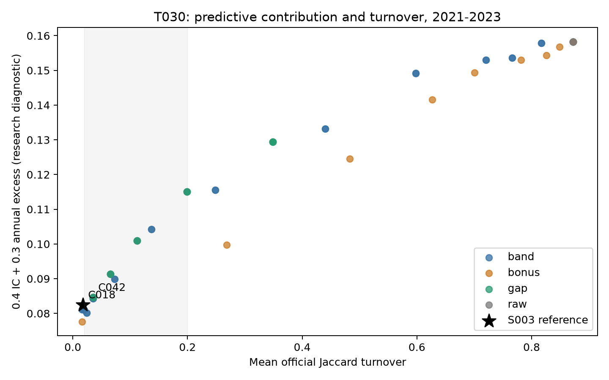
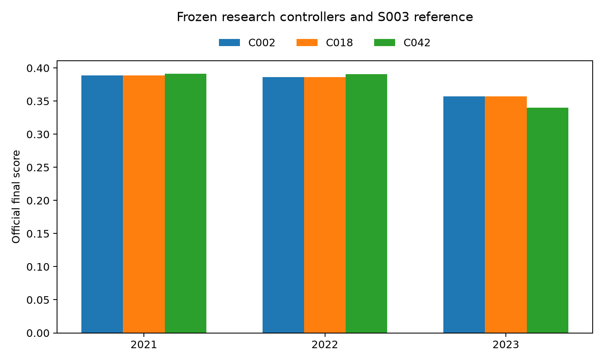
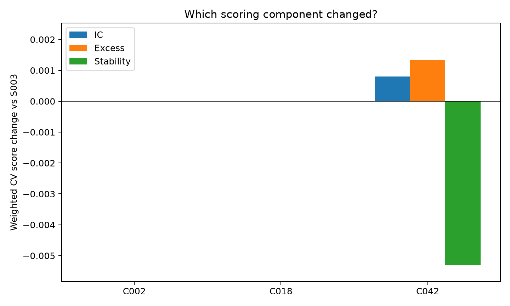
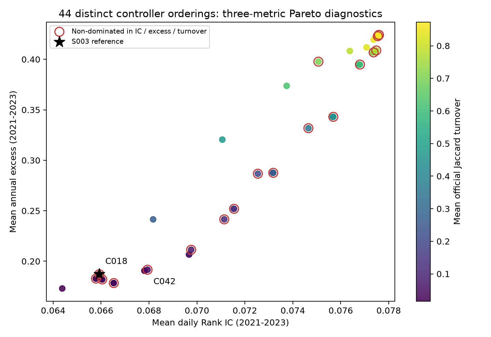

# S004：固定 T030 的换手控制研究

完成时间：2026-10-08T18:44:12+08:00

## 执行范围

复用 S003 T030 的 2021 / 2022 / 2023 原始预测；每折冷启动，共用同一配置。
旧 band、同一实际 Top 集合的按日编码、留仓奖励、排名差与主动替换上限均按预定网格执行。
预定配置 67，完整排序等价去重后 44；
实际落盘并由官方评分器核对 132 个完整折；新增模型训练 **0**。
2024 未参与本阶段计算或选择；S005 / S006 尚未执行。

实现提交：`4563f48f70e0b14c65a208d43875eccb8a6a04af`；代码摘要：`d7d7b5e8270cbb59c746e7d28c18d2f1057e38e8e8b186da67eb92f73e1d3839`；
协议摘要：`952aaeee743afaf63643eacaa756de1bdd69f085696044947a2b76aabd81189b`；控制器锁定摘要：`bc2de100d48ed97e25924908454f3d8dd34b8df90fc0d3654216320264f4c20e`。

## 原始信号与同层参照

|candidate|mean_ic|mean_excess|mean_turnover|cv_mean|wf2023|
|---|---|---|---|---|---|
|C000|0.0775913784|0.4241543508|0.8722162415|0.1966179842|0.1291252475|
|C002|0.0659225508|0.1871793274|0.0174981553|0.3772733720|0.3570976762|

## 最高均分配置（包括排序等价映射）

|candidate|method|cv_mean|cv_std|cv_worst|wf2021|wf2022|wf2023|
|---|---|---|---|---|---|---|---|
|C018|band_minimal|0.3772752567|0.0142988832|0.3570993661|0.3885409833|0.3861854207|0.3570993661|
|C002|band|0.3772733720|0.0142987353|0.3570976762|0.3885388115|0.3861836281|0.3570976762|
|C017|band_minimal|0.3762819306|0.0140063691|0.3567148005|0.3887325400|0.3833984513|0.3567148005|
|C001|band|0.3762800535|0.0140062168|0.3567131080|0.3887303873|0.3833966650|0.3567131080|
|C019|band_minimal|0.3750991357|0.0171063937|0.3509910836|0.3888979907|0.3854083327|0.3509910836|
|C003|band|0.3750971342|0.0171062089|0.3509893403|0.3888958164|0.3854062461|0.3509893403|
|C062|gap|0.3741114504|0.0238887465|0.3403279087|0.3911152306|0.3908912119|0.3403279087|
|C052|gap|0.3741114504|0.0238887465|0.3403279087|0.3911152306|0.3908912119|0.3403279087|
|C057|gap|0.3741114504|0.0238887465|0.3403279087|0.3911152306|0.3908912119|0.3403279087|
|C047|gap|0.3741114504|0.0238887465|0.3403279087|0.3911152306|0.3908912119|0.3403279087|

全部参数、等价映射、逐折八指标和月度 / 季度表见 `experiments/alpha_S004_*`。

## 冻结交给 S006 的两种家族

### C018：band

```json
{
  "method": "band_minimal",
  "keep_q": 0.0022778298112255263
}
```

三折均分 0.3772752567；最差折 0.3570993661；
相对 S003 均分变化 +0.0000018847。

加权 IC / 超额 / 稳定性变化：+0.0000018847 / +0.0000000000 / -0.0000000000。

三折最终候选的历史替换条件满足：**True**。
这里只冻结供后续目标 / 融合研究使用的控制器，不变更正式推荐模型。

### C042：gap

```json
{
  "method": "gap",
  "delta": 0.0,
  "rho": 0.01
}
```

三折均分 0.3741114504；最差折 0.3403279087；
相对 S003 均分变化 -0.0031619216。

加权 IC / 超额 / 稳定性变化：+0.0008062399 / +0.0013336529 / -0.0053018144。

三折最终候选的历史替换条件满足：**False**。
这里只冻结供后续目标 / 融合研究使用的控制器，不变更正式推荐模型。

## 留仓与编码诊断

|candidate|fold|mean_spell_days|p95_spell_days|max_spell_days|mean_selected_raw_rank|mean_raw_top_retained_fraction|mean_selected_below_top20_fraction|
|---|---|---|---|---|---|---|---|
|C002|wf2021|63.2337514253|225.0000000000|243|0.5132343860|0.1636265445|0.7354948539|
|C002|wf2022|79.4264178033|242.0000000000|242|0.5308767510|0.1305517456|0.7665351899|
|C002|wf2023|96.7222222222|242.0000000000|242|0.4960721084|0.1242137339|0.7821347765|
|C018|wf2021|63.2337514253|225.0000000000|243|0.5132343860|0.1636265445|0.7354948539|
|C018|wf2022|79.4264178033|242.0000000000|242|0.5308767510|0.1305517456|0.7665351899|
|C018|wf2023|96.7222222222|242.0000000000|242|0.4960721084|0.1242137339|0.7821347765|
|C042|wf2021|39.7391615908|143.0000000000|243|0.5356623571|0.1799928439|0.7155521635|
|C042|wf2022|45.5687808896|166.0000000000|242|0.5514932215|0.1495991420|0.7443378916|
|C042|wf2023|53.3384394447|199.6000000000|242|0.5169217511|0.1399652796|0.7634245851|

持仓段在折末右删失，停留天数按交易观察计算；较长停留本身不代表收益提高。
同集合编码以旧 band 的实际官方换手 Top 集合为参照，不假设其内部选择等于输出集合。
留仓奖励先计算 rank+bonus，再保持非并列关系、按股票代码打破精确并列并编码严格次序。
因此需把全市场 IC 的变化与 Top 收益的变化分别解释。

## 核对与解释边界

官方八指标最大差 0.000e+00；原始信号 / q* band 参照最大差 0.000e+00；保存文件的 Top 集合全部与预期一致。
原有 363 条实验记录保持不变，新增 132 条派生记录，共享表共 495 条。
冻结控制器已用真实三折的前半段重放核对因果性。原始数据、官方附件和已冻结 S003 输入未改动。
排序 / 并列等价配置只做一次真实落盘评分，映射在比较表中公布；其参数配置仍完整保留。
本轮为有限网格上的历史研究，没有证明全局最优或隐藏测试得分。未新增或运行测试套件。

## 图表







## 后续交接

成员 B 可从选择清单、逐折表和产物索引独立重算；其新一轮复核仍待完成。
S005 接续固定特征 / 参数的目标研究；S006 使用本次两种控制器以及 S003 q* band，
最终完整方案冻结、推送后才执行一次 2024 历史确认。

## 本轮结论与后续决策

**固定 T030 的本轮控制器网格没有获得实质性提分。** 最高 CV 均分为 0.3772752567，
相对 S003 仅增加 0.0000018847，收益与换手相同，变化全部来自编码后的 IC。
该变化略高于计划的数值替换容差，但不能作为新的 Alpha 提升或隐藏测试改善证据。
本阶段不变更正式推荐，继续保留 S003 完整方案作为参照。

留仓奖励最高均分为 0.3727830875（C041），没有超过参照。
C042 的均分为 0.3741114504：2021 / 2022 小幅改善，2023 从 0.3570976762
下降到 0.3403279087；其 2023 年化超额从 0.1357850961
下降到 0.0943849319，换手从 0.0124486621 升到 0.0289919244。
因此 C042 不满足计划的跨年替换条件，只作为第二种结构不同的控制器交给后续融合研究。

**旧方案的低换手确实伴随长期保留原始排名已经降低的股票。** 2023 的平均持仓段约
96.72 个交易观察，持仓股当日原始平均排名分位为 0.4961；
当日原始 Top 的平均保留比例为 12.42%。
C042 将平均持仓段缩到 53.34，原始平均分位升到 0.5169，
但该年的官方收益反而下降。排序更新更快与实现更多收益，在本数据上没有自动等价。
持仓段在折末有右删失，这些长度用于描述实际留仓，不是无偏的未来持仓期限估计。

**48 个按日编码对照的实际 Top 集合全部相同**；年化超额、Top 绝对收益和换手的最大差为
0.000e+00。IC 包含涨停股，Top 收益和换手则剔除涨停股，所以同一选股集合下
改变完整 pred 的相对排序，仍能造成小幅 IC 差异。

排名差方法中，五种替换上限各自对应的 delta=0 / 0.025 / 0.05 / 0.1 / 0.2
在全部三折的完整排序与并列组上相同；20 个重复配置已映射回首个配置。
这个范围的排名差阈值没有区分最终结果，不能从中声称找到了一个唯一最优 delta。
C042 固定 delta=0 是预定同分时选较早编号的结果。

下一步按原计划进入 S005：固定 40 特征与 T030 参数比较训练目标，先看 raw IC 和超额；
再由 S006 比较排名融合与 C018 / C042 / S003 band。正式替换需要完整方案的跨年证据及成员 B 复核。

### 三指标非支配图



横轴 IC、纵轴年化超额、颜色为换手；红色边圈按三项均值标记非支配点。
这是三指标描述性诊断，最终候选仍由预定官方综合分规则选取。
