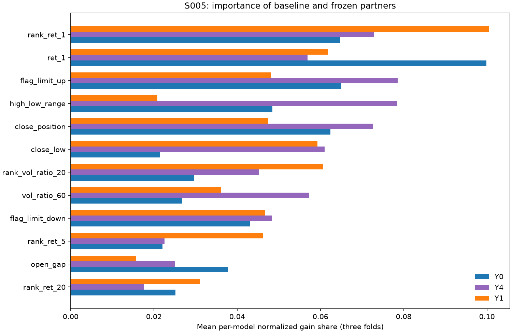
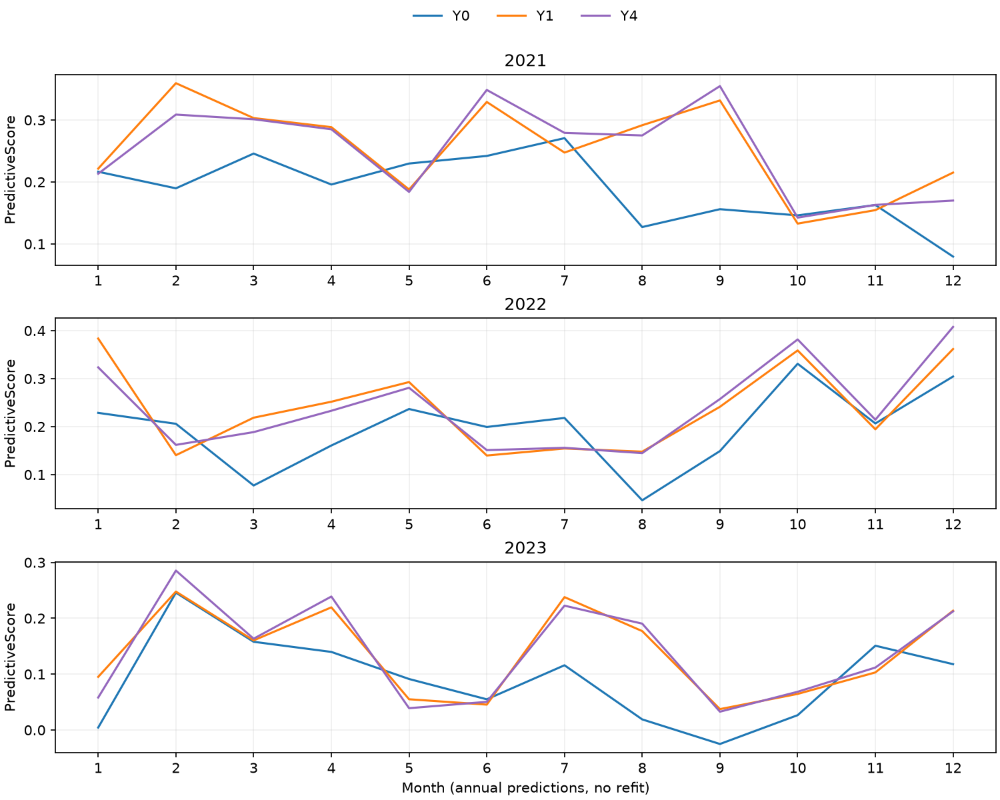
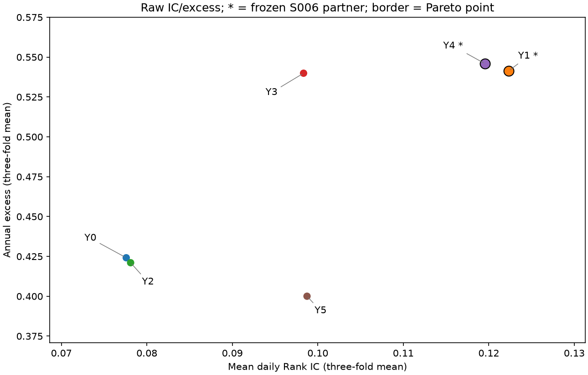
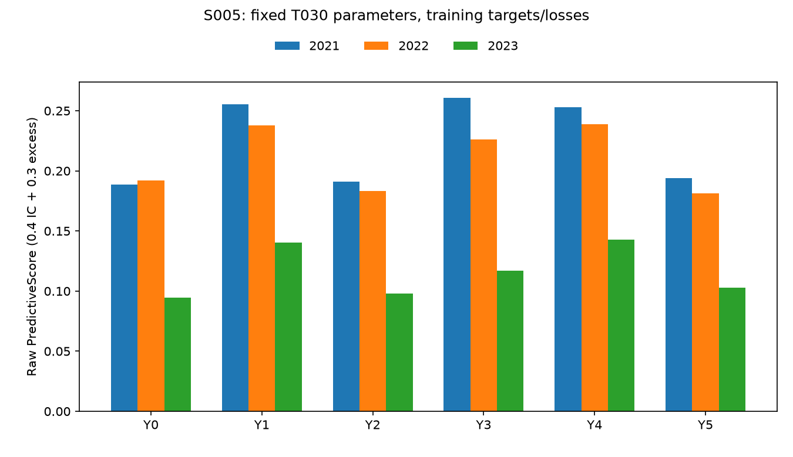

# S005：训练目标与损失研究

完成时间：2026-10-08T21:19:21+08:00（Asia/Shanghai）。

## 协议与来源

实现提交 `6c891eff35d823eae3a241c485e785b51e72f3fa`；协议摘要 `e033b9291d19bfada4eb4f2724a2f9dd68deb3113d783fb294c29cf0f65817c5`；源码摘要 `5569f58c93a61eb76824903d304522b2988634e9f4e37bc726505789a0d526fa`。
参照为冻结 S003 T030，选择摘要 `2206cc007787f8c988f5de191950efb89fcd6ee724d5b96b9f45169e63ec2367`；S004 控制器选择保持 `bc2de100d48ed97e25924908454f3d8dd34b8df90fc0d3654216320264f4c20e`。
固定 V1 40 特征、T030 的结构/正则/采样参数、800 轮、seed=42、CPU 8 线程；每次独立 Dataset，无验证早停。
训练为 2018–2020 / 2021 / 2022，分别验证 2021 / 2022 / 2023。先屏蔽跨界标签，再删除缺 y 或缺价监督样本，再构造目标。
原始预测覆盖 4650 只股票的全部键，缺价行输出 0，按 trade_date、ts_code 排序；验证始终使用原始 y_ret_1d。2024 本轮未训练或评分。

## 目标与原始预测比较

Y0 复用原始收益 L2；Y1 为平均并列日百分位；Y2 为每日线性 1%/99% 缩尾；Y3 为 Y2 的 ddof=0 日标准化（零标准差输出 0）；Y4 与 Y3 目标完全相同、Huber alpha=0.9；Y5 为原始收益 L1。
Y1/Y3/Y4 的输出是排序信号，不能解释成收益百分比。目标统计只作用于监督 y，不进入 X 或验证预测处理。
研究初筛使用 **PredictiveScore = 0.4×IC + 0.3×年化超额**，它不是官方综合分；各原始预测同时公开全部八项官方指标。

|target|transform|objective|predictive_mean|predictive_worst|predictive_2023|mean_ic_mean|mean_annual_excess|mean_mean_turnover|raw_final_mean|selected_for_S006|
|---|---|---|---|---|---|---|---|---|---|---|
|Y0|raw|regression|0.1582828566|0.0943073614|0.0943073614|0.0775913784|0.4241543508|0.8722162415|0.1966179842|False|
|Y1|daily_rank|regression|0.2113403331|0.1406049927|0.1406049927|0.1223270857|0.5413649961|0.8378800881|0.2599763067|True|
|Y2|daily_winsor|regression|0.1575545185|0.0980828822|0.0980828822|0.0781009204|0.4210471678|0.8745394749|0.1951926760|False|
|Y3|daily_winsor_zscore|regression|0.2013071522|0.1171134454|0.1171134454|0.0983345937|0.5399110490|0.8566642494|0.2443078774|False|
|Y4|daily_winsor_zscore|huber|0.2115911261|0.1426758294|0.1426758294|0.1195562635|0.5458954022|0.8655469125|0.2519270523|True|
|Y5|raw|regression_l1|0.1595032148|0.1029234323|0.1029234323|0.0987380184|0.4000266917|0.8463776490|0.2055899202|False|

### 逐年官方指标

|target|fold|ic_mean|annual_excess|mean_turnover|final_score|predictive_score|
|---|---|---|---|---|---|---|
|Y0|wf2021|0.0794982884|0.5222501877|0.8662557951|0.2285976332|0.1884743717|
|Y0|wf2022|0.0918571110|0.5177466410|0.8664525497|0.2321310718|0.1920668367|
|Y0|wf2023|0.0614187359|0.2324662236|0.8839403796|0.1291252475|0.0943073614|
|Y1|wf2021|0.1296720988|0.6791810431|0.8417776291|0.3030898637|0.2556231524|
|Y1|wf2022|0.1316006383|0.6171753296|0.8370063671|0.2866909441|0.2377928542|
|Y1|wf2023|0.1057085199|0.3277386158|0.8348562682|0.1901481122|0.1406049927|
|Y2|wf2021|0.0790328281|0.5318475227|0.8659571928|0.2313802302|0.1911673880|
|Y2|wf2022|0.0931781668|0.4871400619|0.8713290025|0.2220145845|0.1834132853|
|Y2|wf2023|0.0620917663|0.2441539188|0.8863322292|0.1321832134|0.0980828822|
|Y3|wf2021|0.1079140973|0.7250255138|0.8557781132|0.3039398591|0.2606732931|
|Y3|wf2022|0.1109833401|0.6058046071|0.8540640315|0.2699155087|0.2261347182|
|Y3|wf2023|0.0761063438|0.2889030262|0.8601506033|0.1590682644|0.1171134454|
|Y4|wf2021|0.1240158292|0.6784773362|0.8726151416|0.2913649901|0.2531495325|
|Y4|wf2022|0.1303190270|0.6227346848|0.8632617264|0.2799694983|0.2389480162|
|Y4|wf2023|0.1043339342|0.3364741858|0.8607638694|0.1844466686|0.1426758294|
|Y5|wf2021|0.1006584059|0.5129983336|0.8370911877|0.2430355061|0.1941628624|
|Y5|wf2022|0.1077775745|0.4610410668|0.8442252867|0.2281557638|0.1814233498|
|Y5|wf2023|0.0877780747|0.2260406746|0.8578164726|0.1455784905|0.1029234323|

## 归因与互补性

新目标最高原始 PredictiveScore 为 Y4 的 0.2115911261，相对 Y0 0.1582828566 变化 +0.0533082695；2023 变化 +0.0483684680。
IC/超额二维非支配点为 Y1、Y4；它用于解释，不改变预定选优规则。
与 T030 的相关性为全市场当日平均百分位的 Pearson 相关（即 Spearman）；Top 重合只删除涨停，使用官方非稳定降序排序，不读取 y 或缺失掩码。

|target|rank_correlation|eligible_top_overlap|eligible_top_jaccard|mean_exact_ties|
|---|---|---|---|---|
|Y0|1.0000000000|1.0000000000|1.0000000000|428.9542847102|
|Y1|0.4944897507|0.3577526371|0.2231186724|428.9432654264|
|Y2|0.9619535594|0.8275832283|0.7069488846|428.9473806528|
|Y3|0.6656157713|0.4970454823|0.3341881845|428.9418880160|
|Y4|0.5606399664|0.3675767833|0.2318202093|428.9405106055|
|Y5|0.7334934354|0.5708486098|0.4031012477|428.9556677890|

Y3/Y4 三折训练目标摘要完全相同：True；差异隔离为损失变化。相同原始收益下的 Y5/Y0 对照隔离为 L1/L2。
目标尺度变化时固定 lambda 等正则参数的相对作用也会变化；本轮只能说明固定 T030 预算下的结果。收益改善与 IC 改善分别报告，较低相关性不保证融合提分。

## S006 交接与阶段结论

按三折原始 PredictiveScore 均值选择两个新目标，同分容差 1e-6 内优先最差折、编号；冻结伙伴为 **Y1、Y4**。
这是下一阶段融合的研究伙伴，不是正式替换方案。本轮没有对新目标重扫 band，也未启动 S006 或 2024 确认；完整官方分和弱年门槛在 S006 判断。正式研究参照继续保留 S003。
成员 B 接续独立核对训练日期、目标统计、损失参数、完整预测与原始评分；目前不声称已完成 B 复核。

## 实际核对与产物

15 次新模型训练 / 15 条新增真实记录；Y0 三折复用不记新训练。官方八指标最大差 0.000e+00；模型重载最大差 0.000e+00；保存 CSV 排名与并列组一致。
12 份唯一训练目标映射，全部实际训练前缀重放通过；Y3/Y4 共用映射。跨界剔除标签为 3853 / 4170 / 4280，相同监督样本数为 2594048 / 3568878 / 4597785。
原 495 条实验记录保持不变，新增 15 条，共 510 条；原始数据、官方附件、S003/S004 来源和特征缓存不变。未新增或运行测试套件。
源码与数值协议先提交推送后执行。选择 canonical digest `9809105475dbe5de31475a0eea50d8418405b24fa68c096037ae3049fbe33018`；完整 SHA 索引见 `alpha_research_S005_artifacts.json`。

- `experiments/alpha_S005_{comparison,folds,monthly,quarterly,agreement,target_statistics,importance}.csv`：小型指标、非支配与解释表。
- `outputs/metrics/research_studies/S005/targets/`：按键的 raw y / transformed y / training_position、每日统计、摘要与因果前缀核对。
- `outputs/models/S005_Yx_wf20xx_raw/`：模型、配置、运行清单；`outputs/predictions/`：全量原始预测。
- `outputs/metrics/S005_Yx_wf20xx_raw/`：官方八指标、日/月/季度、模型重要性、按日预测相关性与实际 Top 重合。大型产物保留本地忽略目录。

## 图表

## API 依据

损失与 alpha 支持核对于 2026-10-08，见 [LightGBM 4.7.0 官方参数](https://lightgbm.readthedocs.io/en/v4.7.0/Parameters.html#objective-parameters)。这些参数支持事实不构成效果保证。

## 补充判读与发布核对

冻结伙伴的原始预测变化：Y4 均值比 Y0 变化 +0.0533082695，2023 变化 +0.0483684680；Y1 均值比 Y0 变化 +0.0530574765，2023 变化 +0.0462976313。
Y1 的三折均值 IC 为 0.1223270857，Y4 为 0.1195562635；年化超额分别为 0.5413649961 / 0.5458954022。Y4−Y1 的初筛均分差为 +0.0002507929，原始官方分差为 -0.0080492543；两个排名的区别还包含换手项影响。预定初筛使用 PredictiveScore，冻结顺序为 Y4、Y1。
与 T030 的互补性诊断：Y4 当日排名相关性 0.560640，实际可选 Top 重合均值 36.76%；Y1 当日排名相关性 0.494490，实际可选 Top 重合均值 35.78%。该相关性包含缺价兜底行，不等同于有效报价股票的相关性；不同目标尺度还会影响 0 兜底值的排序位置。是否形成融合提分仍须 S006 实际评分。
其他目标相对 Y0 的 PredictiveScore 均值变化：Y2 -0.0007283381；Y3 +0.0430242956；Y5 +0.0012203582。分项变化见下表，所有结果和模型均保留。

|target|weighted_ic_delta|weighted_excess_delta|predictive_delta|stability_delta|raw_final_delta|
|---|---|---|---|---|---|
|Y0|0.0000000000|0.0000000000|0.0000000000|-0.0000000000|0.0000000000|
|Y1|0.0178942829|0.0351631936|0.0530574765|0.0103008460|0.0633583225|
|Y2|0.0002038168|-0.0009321549|-0.0007283381|-0.0006969700|-0.0014253081|
|Y3|0.0082972861|0.0347270095|0.0430242956|0.0046655976|0.0476898932|
|Y4|0.0167859540|0.0365223154|0.0533082695|0.0020007987|0.0553090682|
|Y5|0.0084586560|-0.0072382977|0.0012203582|0.0077515777|0.0089719360|

### 月度稳定性

|target|fold|positive_ic_months|positive_excess_months|months_predictive_above_Y0|worst_predictive_month|worst_month_predictive|
|---|---|---|---|---|---|---|
|Y0|wf2021|12|12|0|202112|0.0796008222|
|Y0|wf2022|12|12|0|202208|0.0465378002|
|Y0|wf2023|12|10|0|202309|-0.0250425812|
|Y1|wf2021|12|12|8|202110|0.1328573393|
|Y1|wf2022|12|12|8|202206|0.1398367864|
|Y1|wf2023|12|12|9|202309|0.0374255333|
|Y4|wf2021|12|12|9|202110|0.1424905735|
|Y4|wf2022|12|12|9|202208|0.1448194063|
|Y4|wf2023|12|12|9|202309|0.0327997740|

这里每年均为 12 个月；月度年化量来自该月均值，不能当作已实现的年度复合收益。2023 仍是三折最弱年份，尚未在完整方案下判断改善是否足够。

重要性先在每个模型/折内部把 gain 归一化，再按三折取均值；它描述模型使用的特征，不代表因果贡献。完整 40 列统计在 importance 表。

十五次训练均在原实现提交完成。首次报告渲染把表格行列表当成字符串，发布阶段中断；随后只增加换行转换适配和读取已通过产物的发布恢复入口，新增拟合 / 评分 / 选择变更均为 0。
恢复前逐文件核对模型、预测、目标映射、来源和原记录；原数值源码通过 Git 字节摘要与 AST 比较保留，改动仅限表格格式适配。原错误及恢复代码摘要列入交接索引。
