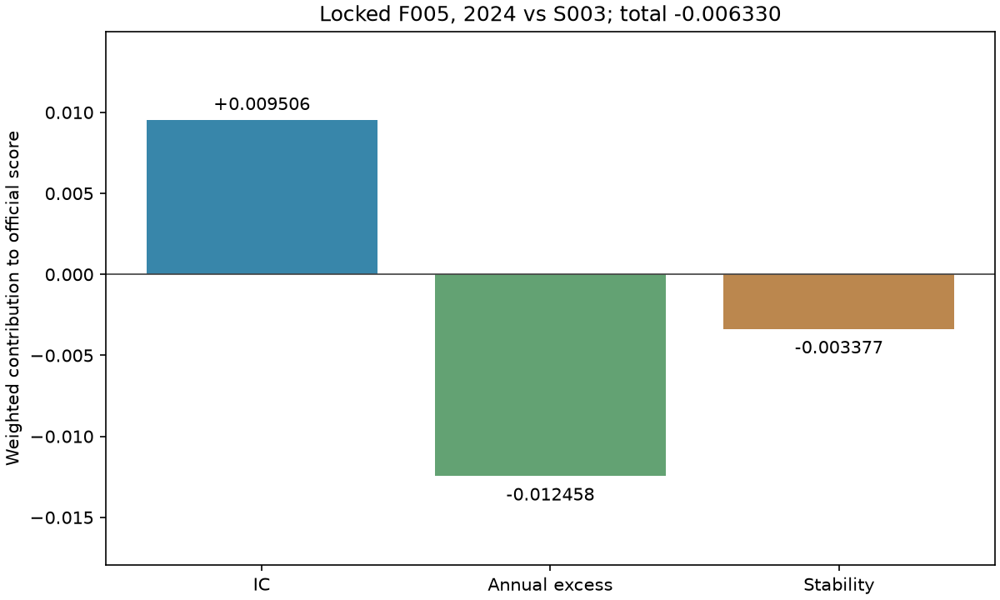

# S006：有限排名融合与冻结控制器研究

更新时间：2026-10-08T23:24:21+08:00（Asia/Shanghai）。

## 协议与来源

实现提交 `c2a15e75ff3dfedcbd08c0b5e1717a81cea53bb6`，源码摘要 `ca7563ca1ab91c6b28b84508fa76a9fe5600e76ebc8c1108172da6c2ce8f58f9`，协议摘要 `21051271d30cebb94f83a2e1f33a3d65186524ddf353b527899c5d29c79adfd0`。
仅用 2021–2023 的原始预测筛选历史伙伴并比较完整方案；S005 的 Y4 / Y1 和 S004 的两个控制器均保持冻结。V1 40 特征不变。
历史 50 个 trial 的三折 raw 清单按冻结 SHA 校验，先取 raw PredictiveScore 最高的 10 个并加 T030；同参数/轮数、或三折解析预测完全相同者去重。历史第一伙伴取最高 raw 分，第二个取与 T030 及第一伙伴的平均日排名相关性最低者；相关性 1e-12 内同分按质量和 trial 编号。相关性是研究假设，最终选择使用官方完整分。

|model|raw_predictive_mean|raw_predictive_worst|rounds|
|---|---|---|---|
|T008|0.1672780114|0.1061127648|800|
|T016|0.1631030681|0.1069059212|800|

组成模型为 T030、Y4、Y1、T008、T016。新目标固定 T030 的 800 轮；历史伙伴保留其原 trial 的完整参数及实际轮数。
构造 18 个信号 × 3 个控制器 = 54 个完整配置；单模型端点复用真实来源，完整排序/并列组等价时共享评分并公开映射。CV 新训练次数为 0。
融合使用现有 rank_blend 的当日平均百分位。为避免 CSV 解析合并浮点近似并列，融合后用当日平均排名的两倍整数保存；它严格保持原生 rank_blend 的实际顺序和精确并列，原生浮点预测另存无损 Parquet。单模型保留原 pred。输出是排序信号，不解释成收益率。
控制器为 S003 q* band、S004 C018 的按日最小间隔编码和 C042 的 gap(delta=0,rho=0.01)；每折冷启动，处理侧只接收键、预测、涨停标志与历史状态，不接收 y 或缺失 y 掩码。
所有 CSV/评分均为 trade_date、ts_code 升序；官方收益池还删缺 y，换手池仅删涨停，两者分别由官方代码计算。

## 完整三折比较

原 S003 完整方案三折均分 0.3772733720、最差折 0.3570976762。
选择要求均值提高超过 1e-6，最差折及 2023 不低于参照−1e-6；合格池内按最高均值，同分依次优先最差折、模型更少、编号。
锁定 **F005：Y4，权重 [1.0]，控制器 Q2 / {'method': 'gap', 'delta': 0.0, 'rho': 0.01}**。CV 均分 0.4096782475，最差折 0.3950504494，2023 0.3950504494。
不受门槛约束的最高均值是 F005 的 0.4096782475；所有配置均公开。

|candidate|components|weights|controller|cv_mean|cv_worst|wf2023|passes_cv_gate|
|---|---|---|---|---|---|---|---|
|F005|Y4|[1.0]|Q2|0.4096782475|0.3950504494|0.3950504494|True|
|F004|Y4|[1.0]|Q1|0.4062116058|0.3839288174|0.3839288174|True|
|F003|Y4|[1.0]|Q0|0.4062097904|0.3839241647|0.3839241647|True|
|F007|Y1|[1.0]|Q1|0.4014313457|0.3851582510|0.3851582510|True|
|F006|Y1|[1.0]|Q0|0.4014308529|0.3851548946|0.3851548946|True|
|F008|Y1|[1.0]|Q2|0.3987200784|0.3694351178|0.3694351178|True|
|F025|T030+Y1|[0.25, 0.75]|Q1|0.3954530274|0.3775589157|0.3775589157|True|
|F024|T030+Y1|[0.25, 0.75]|Q0|0.3954516003|0.3775557755|0.3775557755|True|
|F028|T030+Y1|[0.5, 0.5]|Q1|0.3951427811|0.3724830286|0.3724830286|True|
|F027|T030+Y1|[0.5, 0.5]|Q0|0.3951408067|0.3724804629|0.3724804629|True|
|F026|T030+Y1|[0.25, 0.75]|Q2|0.3939450809|0.3600496984|0.3600496984|True|
|F016|T030+Y4|[0.25, 0.75]|Q1|0.3933991634|0.3745215866|0.3745215866|True|

完整逐折八指标、raw 指标和排序等价映射分别在 folds / raw_signals / comparison 表；原始 signal 的 PredictiveScore 仅为辅助分析。

## 分项归因与弱年表现

|candidate|mean_ic|mean_excess|mean_turnover|cv_delta_vs_S003|ic_component_change|excess_component_change|stability_component_change|
|---|---|---|---|---|---|---|---|
|F005|0.1079852954|0.2516124132|0.0299986488|0.0324048755|0.0168250978|0.0193299257|-0.0037501480|

月度/季度沿用全年已计算的状态，不重新训练或在月初重启。持仓段包含折末右删失，按交易观察计数；实际 Top 从保存后的 pred 解码核对。

### 2023 全部月份

|candidate|month|ic_mean|annual_excess|mean_turnover|final_score|
|---|---|---|---|---|---|
|F000|202301|0.0701235231|0.3838954158|0.0137929336|0.4390801539|
|F000|202302|0.1003637956|0.1682012628|0.0125790559|0.3868321803|
|F000|202303|0.0508922572|-0.0111738524|0.0108448932|0.3137512792|
|F000|202304|0.0414064797|-0.0490166028|0.0149330964|0.2973776821|
|F000|202305|0.0631923422|0.4096853411|0.0127259187|0.4443647636|
|F000|202306|0.0413378160|0.2610161820|0.0228880185|0.3879735754|
|F000|202307|0.0628102132|-0.2037648181|0.0122040337|0.2603334297|
|F000|202308|0.0220119532|0.2105600115|0.0108602167|0.3687147197|
|F000|202309|0.0126508145|0.2424348477|0.0091596586|0.3750428825|
|F000|202310|0.0189809241|-0.0026614375|0.0142224810|0.3025271941|
|F000|202311|0.0698715249|0.2632920475|0.0094300488|0.4041072096|
|F000|202312|0.0496798060|-0.0015129382|0.0075098190|0.3171650953|
|F005|202301|0.1012067252|0.0856663235|0.0223511830|0.3594772322|
|F005|202302|0.1647896271|0.6178968630|0.0204938909|0.5451367425|
|F005|202303|0.1020142683|0.3404718933|0.0199492530|0.4369624994|
|F005|202304|0.0968716813|0.6486588578|0.0225682463|0.5265758560|
|F005|202305|0.0743347551|0.0395456539|0.0221399375|0.3349556169|
|F005|202306|0.0731826059|-0.0216273567|0.0244233173|0.3154578402|
|F005|202307|0.1181733758|0.1438790249|0.0266156289|0.3824483691|
|F005|202308|0.0934419640|0.3956627819|0.0280724225|0.4476538934|
|F005|202309|0.0575442103|-0.0176192118|0.0234699497|0.3106909357|
|F005|202310|0.0650272820|-0.1133184204|0.0277490200|0.2836906807|
|F005|202311|0.1004989033|0.1819184840|0.0255540566|0.3871088895|
|F005|202312|0.0999498288|0.1604897285|0.0231938326|0.3811687003|

## 2024 一次历史确认

冻结选择于 `3ab882fc85d0dc96ac8836499e6729f521245913` 先提交、推送 main，再确认；新增模型训练 1 次。
锁定方案 2024 综合分 **0.3810523173**，门槛 0.3873823479；确认门槛结果 **False**，后续结论 `retain_S003`。
2024 不重新选择组成模型、权重、控制器或参数。诊断层按锁定清单预先规定，重合排序共享真实评分。

|layer|ic_mean|annual_excess|mean_turnover|final_score|
|---|---|---|---|---|
|T030_raw|0.0987252994|0.4522342575|0.8605334796|0.2170003531|
|T030_qstar|0.0843562247|0.2011622338|0.0223627069|0.3873823479|
|component_raw_Y4|0.1178438963|0.4159944841|0.8424115386|0.2192124422|
|new_signal_raw|0.1178438963|0.4159944841|0.8424115386|0.2192124422|
|new_signal_qstar|0.1045585727|0.1862864136|0.0170379565|0.3925979662|
|new_complete|0.1081201808|0.1596342862|0.0336201364|0.3810523173|
|T030_selected_controller|0.0870847498|0.1887774940|0.0404991798|0.3793173942|

### 2024 全部月份（含 1 月）

|candidate|month|ic_mean|annual_excess|mean_turnover|final_score|
|---|---|---|---|---|---|
|F000|202401|0.0216525215|-0.4051534122|0.0139638602|0.1829258269|
|F000|202402|0.2156441886|0.7605914265|0.0462353889|0.6005644867|
|F000|202403|0.1243275841|0.2956544216|0.0233977824|0.4314080254|
|F000|202404|0.0695850450|0.1069577561|0.0275268775|0.3516632816|
|F000|202405|0.0825366967|0.2173442937|0.0180130389|0.3928140551|
|F000|202406|0.0548490652|0.0575745051|0.0116075190|0.3357297219|
|F000|202407|0.0441494427|0.2500153848|0.0190403923|0.3869522748|
|F000|202408|0.0563820644|0.0341042198|0.0116867987|0.3292780521|
|F000|202409|0.0710590279|0.9745639010|0.0250264437|0.6132848484|
|F000|202410|0.1001835371|-0.0124476499|0.0438536778|0.3231830165|
|F000|202411|0.1199607418|0.0481433821|0.0203607083|0.3563190989|
|F000|202412|0.0945135623|0.2996704848|0.0178392617|0.4223547918|
|F005|202401|0.0668268791|-0.1420988012|0.0233209821|0.2771048166|
|F005|202402|0.1220635517|0.7517161695|0.0615912925|0.5558628838|
|F005|202403|0.1337819175|0.3242740275|0.0351720753|0.4402433527|
|F005|202404|0.1117136429|0.4535927245|0.0387781682|0.4691298240|
|F005|202405|0.1219365711|0.2937326533|0.0257080750|0.4291820019|
|F005|202406|0.0862763491|0.1828055953|0.0257752590|0.3816196405|
|F005|202407|0.0800817844|0.0029671332|0.0284869908|0.3243767565|
|F005|202408|0.1055624345|0.0763924990|0.0243580167|0.3578353185|
|F005|202409|0.0775895174|-0.3004449762|0.0414574564|0.2284650772|
|F005|202410|0.1288979905|0.1074806594|0.0453595802|0.3701955200|
|F005|202411|0.1238924887|-0.2696027454|0.0351392602|0.2581343938|
|F005|202412|0.1446319291|0.5881336907|0.0289822164|0.5255982139|

## 实际核对与交接

所有实际保存评分的官方八指标最大差 0.000e+00；模型重载最大差 0.000e+00。
原 510 条共享记录保持不变，新增 196 条真实记录，共 706 条；当前研究新拟合 1 次。
锁定 canonical digest `0d9dcadff208cf15b8515eac33ee8985efd2693826639bad9f80327738257409`，预定信号/控制器前缀重放 3 折通过。原始数据、官方附件和所有已冻结来源保持核对。
来源、运行清单和完整产物 SHA 在 artifacts 索引；history 表保留初筛、相关性与去重理由。大型模型、native Parquet、预测 CSV 和状态仅保留本地忽略目录。
2021–2024 均为已经使用过的历史验证期，累计筛选存在选择偏差；正式测试得分需要官方隐藏标签。成员 B 独立复核与正式方案/测试初始状态由团队后续接续。本轮不生成比赛 submission，不新增或运行测试套件。

## 图表

## 最终判读与交接决定

锁定候选未通过既定确认门槛，本轮结论为保留 S003。预定诊断中更高的其他分数不替代已锁定方案；没有追加模型、权重或控制器搜索。

三折 CV 均值达到 0.4096782475，超过 0.4；2024 锁定结果为 0.3810523173，相对 S003 变化 -0.0063300307。跨年门槛按事先规则判断，不能仅凭 CV 最高值改用正式方案。
2024 的 IC 加权变化 +0.0095055824，超额项 -0.0124583843，稳定性项 -0.0033772288；IC 的改善被另两项抵消。

|layer|weighted_ic_delta|weighted_excess_delta|weighted_stability_delta|final_delta_vs_S003|
|---|---|---|---|---|
|T030_raw|0.0057476299|0.0753216071|-0.2514512318|-0.1703819948|
|T030_qstar|0.0000000000|0.0000000000|-0.0000000000|0.0000000000|
|component_raw_Y4|0.0133950686|0.0644496751|-0.2460146495|-0.1681699058|
|new_signal_raw|0.0133950686|0.0644496751|-0.2460146495|-0.1681699058|
|new_signal_qstar|0.0080809392|-0.0044627461|0.0015974251|0.0052156183|
|new_complete|0.0095055824|-0.0124583843|-0.0033772288|-0.0063300307|
|T030_selected_controller|0.0010914100|-0.0037154219|-0.0054409419|-0.0080649538|

同年原始 Y4 信号的 IC 提高，但超额低于 T030，raw PredictiveScore 变化 -0.0032244932。这说明目标研究在固定预算下的跨年收益优势没有完整保持，不能把原始综合分的微升等同于预测收益项提高。
预定诊断 Y4 + q* band 得分 0.3925979662，而 T030 + gap 得分 0.3793173942；控制器在 2024 的取舍与 CV 不同。这些层用于归因；重新选用其中任何方案需要后续独立冻结协议。

### 全年与弱月份

|year|months_above_S003|new_worst_month|new_worst_month_score|S003_worst_month|S003_worst_month_score|
|---|---|---|---|---|---|
|2021|7|202108|0.3629632700|202112|0.3064574507|
|2022|10|202207|0.3600718380|202211|0.3443962839|
|2023|6|202310|0.2836906807|202307|0.2603334297|
|2024|8|202409|0.2284650772|202401|0.1829258269|

2024 年 1 月从 0.1829258269 提高到 0.2771048166，变化 +0.0941789897；该月改善仍不能抵消全年其他时期的退化。2024 退步最多的三个月如下。

|month|S003_final|new_final|final_delta|
|---|---|---|---|
|202409|0.6132848484|0.2284650772|-0.3848197712|
|202411|0.3563190989|0.2581343938|-0.0981847051|
|202407|0.3869522748|0.3243767565|-0.0625755184|

月度量是该月日均指标的年化统计，不是年度复合收益；季度、日度及完整月份都保留。

该判读读取已通过的实际表格，不拟合、不重评预测、不改变冻结选择。数值源码 / 配置 / 依赖与各产物摘要保留，本次报告模块单独索引。S004–S006 实际新增训练为 0 + 15 + 1 = 16 次，低于原定 18 次上限。正式测试预测、提交生成、团队初始状态及成员 B 复核由后续接续。
