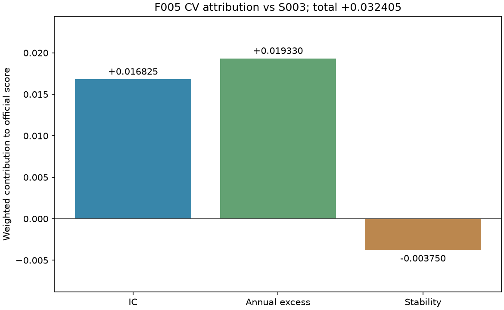
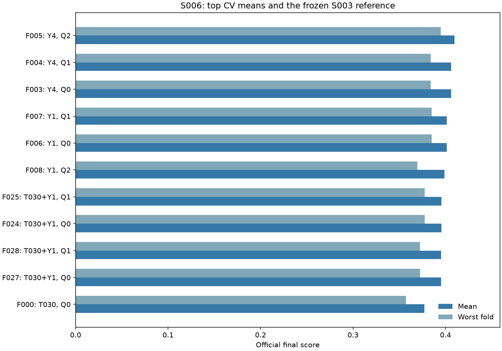
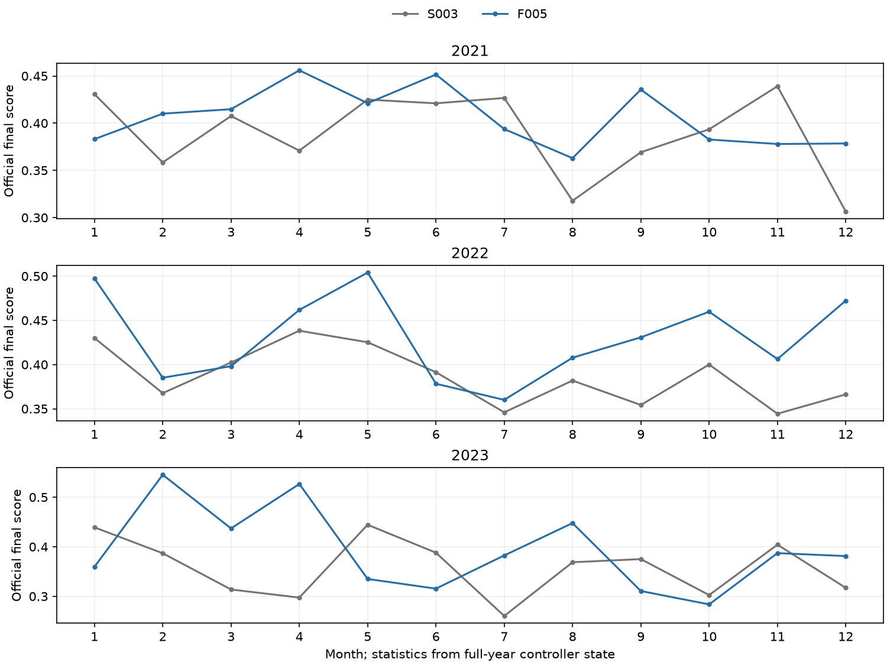
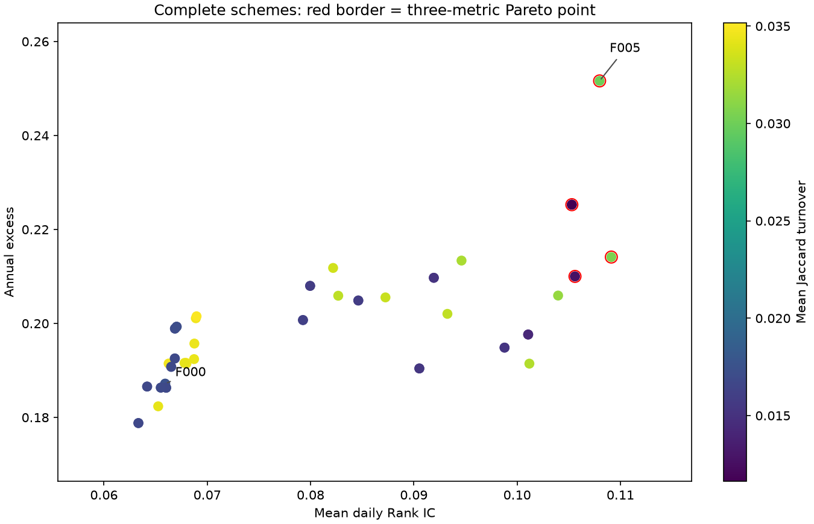

# S006：有限排名融合与冻结控制器研究

更新时间：2026-10-08T23:11:36+08:00（Asia/Shanghai）。

## 协议与来源

实现提交 `c2a15e75ff3dfedcbd08c0b5e1717a81cea53bb6`，源码摘要 `ca7563ca1ab91c6b28b84508fa76a9fe5600e76ebc8c1108172da6c2ce8f58f9`，协议摘要 `21051271d30cebb94f83a2e1f33a3d65186524ddf353b527899c5d29c79adfd0`。
仅用 2021–2023 的原始预测筛选历史伙伴并比较完整方案；S005 的 Y4 / Y1 和 S004 的两个控制器均保持冻结。V1 40 特征不变。
历史 50 个 trial 的三折 raw 清单按冻结 SHA 校验，先取 raw PredictiveScore 最高的 10 个并加 T030；同参数/轮数、或三折解析预测完全相同者去重。历史第一伙伴取最高 raw 分，第二个取与 T030 及第一伙伴的平均日排名相关性最低者；相关性 1e-12 内同分按质量和 trial 编号。相关性是研究假设，最终选择使用官方完整分。

|model|raw_predictive_mean|raw_predictive_worst|rounds|
|---|---|---|---|
|T008|0.1672780114|0.1061127648|800|
|T016|0.1631030681|0.1069059212|800|

组成模型为 T030、Y4、Y1、T008、T016。新目标固定 T030 的 800 轮；历史伙伴保留其原 trial 的完整参数及实际轮数。
构造 18 个信号 × 3 个控制器 = 54 个完整配置；单模型端点复用真实来源，完整排序/并列组等价时共享评分并公开映射。CV 新训练次数为 0。
融合使用现有 rank_blend 的当日平均百分位。为避免 CSV 解析合并浮点近似并列，融合后用当日平均排名的两倍整数保存；它严格保持原生 rank_blend 的实际顺序和精确并列，原生浮点预测另存无损 Parquet。单模型保留原 pred。输出是排序信号，不解释成收益率。
控制器为 S003 q* band、S004 C018 的按日最小间隔编码和 C042 的 gap(delta=0,rho=0.01)；每折冷启动，处理侧只接收键、预测、涨停标志与历史状态，不接收 y 或缺失 y 掩码。
所有 CSV/评分均为 trade_date、ts_code 升序；官方收益池还删缺 y，换手池仅删涨停，两者分别由官方代码计算。

## 完整三折比较

原 S003 完整方案三折均分 0.3772733720、最差折 0.3570976762。
选择要求均值提高超过 1e-6，最差折及 2023 不低于参照−1e-6；合格池内按最高均值，同分依次优先最差折、模型更少、编号。
锁定 **F005：Y4，权重 [1.0]，控制器 Q2 / {'method': 'gap', 'delta': 0.0, 'rho': 0.01}**。CV 均分 0.4096782475，最差折 0.3950504494，2023 0.3950504494。
不受门槛约束的最高均值是 F005 的 0.4096782475；所有配置均公开。

|candidate|components|weights|controller|cv_mean|cv_worst|wf2023|passes_cv_gate|
|---|---|---|---|---|---|---|---|
|F005|Y4|[1.0]|Q2|0.4096782475|0.3950504494|0.3950504494|True|
|F004|Y4|[1.0]|Q1|0.4062116058|0.3839288174|0.3839288174|True|
|F003|Y4|[1.0]|Q0|0.4062097904|0.3839241647|0.3839241647|True|
|F007|Y1|[1.0]|Q1|0.4014313457|0.3851582510|0.3851582510|True|
|F006|Y1|[1.0]|Q0|0.4014308529|0.3851548946|0.3851548946|True|
|F008|Y1|[1.0]|Q2|0.3987200784|0.3694351178|0.3694351178|True|
|F025|T030+Y1|[0.25, 0.75]|Q1|0.3954530274|0.3775589157|0.3775589157|True|
|F024|T030+Y1|[0.25, 0.75]|Q0|0.3954516003|0.3775557755|0.3775557755|True|
|F028|T030+Y1|[0.5, 0.5]|Q1|0.3951427811|0.3724830286|0.3724830286|True|
|F027|T030+Y1|[0.5, 0.5]|Q0|0.3951408067|0.3724804629|0.3724804629|True|
|F026|T030+Y1|[0.25, 0.75]|Q2|0.3939450809|0.3600496984|0.3600496984|True|
|F016|T030+Y4|[0.25, 0.75]|Q1|0.3933991634|0.3745215866|0.3745215866|True|

完整逐折八指标、raw 指标和排序等价映射分别在 folds / raw_signals / comparison 表；原始 signal 的 PredictiveScore 仅为辅助分析。

## 分项归因与弱年表现

|candidate|mean_ic|mean_excess|mean_turnover|cv_delta_vs_S003|ic_component_change|excess_component_change|stability_component_change|
|---|---|---|---|---|---|---|---|
|F005|0.1079852954|0.2516124132|0.0299986488|0.0324048755|0.0168250978|0.0193299257|-0.0037501480|

月度/季度沿用全年已计算的状态，不重新训练或在月初重启。持仓段包含折末右删失，按交易观察计数；实际 Top 从保存后的 pred 解码核对。

### 2023 全部月份

|candidate|month|ic_mean|annual_excess|mean_turnover|final_score|
|---|---|---|---|---|---|
|F000|202301|0.0701235231|0.3838954158|0.0137929336|0.4390801539|
|F000|202302|0.1003637956|0.1682012628|0.0125790559|0.3868321803|
|F000|202303|0.0508922572|-0.0111738524|0.0108448932|0.3137512792|
|F000|202304|0.0414064797|-0.0490166028|0.0149330964|0.2973776821|
|F000|202305|0.0631923422|0.4096853411|0.0127259187|0.4443647636|
|F000|202306|0.0413378160|0.2610161820|0.0228880185|0.3879735754|
|F000|202307|0.0628102132|-0.2037648181|0.0122040337|0.2603334297|
|F000|202308|0.0220119532|0.2105600115|0.0108602167|0.3687147197|
|F000|202309|0.0126508145|0.2424348477|0.0091596586|0.3750428825|
|F000|202310|0.0189809241|-0.0026614375|0.0142224810|0.3025271941|
|F000|202311|0.0698715249|0.2632920475|0.0094300488|0.4041072096|
|F000|202312|0.0496798060|-0.0015129382|0.0075098190|0.3171650953|
|F005|202301|0.1012067252|0.0856663235|0.0223511830|0.3594772322|
|F005|202302|0.1647896271|0.6178968630|0.0204938909|0.5451367425|
|F005|202303|0.1020142683|0.3404718933|0.0199492530|0.4369624994|
|F005|202304|0.0968716813|0.6486588578|0.0225682463|0.5265758560|
|F005|202305|0.0743347551|0.0395456539|0.0221399375|0.3349556169|
|F005|202306|0.0731826059|-0.0216273567|0.0244233173|0.3154578402|
|F005|202307|0.1181733758|0.1438790249|0.0266156289|0.3824483691|
|F005|202308|0.0934419640|0.3956627819|0.0280724225|0.4476538934|
|F005|202309|0.0575442103|-0.0176192118|0.0234699497|0.3106909357|
|F005|202310|0.0650272820|-0.1133184204|0.0277490200|0.2836906807|
|F005|202311|0.1004989033|0.1819184840|0.0255540566|0.3871088895|
|F005|202312|0.0999498288|0.1604897285|0.0231938326|0.3811687003|

## 2024 一次历史确认

本报告为三折锁定结果。合格候选须先提交、推送冻结清单，才可进行预定的 2024 确认。

## 实际核对与交接

所有实际保存评分的官方八指标最大差 0.000e+00；模型重载最大差 0.000e+00。
原 510 条共享记录保持不变，新增 192 条真实记录，共 702 条；当前研究新拟合 0 次。
锁定 canonical digest `0d9dcadff208cf15b8515eac33ee8985efd2693826639bad9f80327738257409`，预定信号/控制器前缀重放 3 折通过。原始数据、官方附件和所有已冻结来源保持核对。
来源、运行清单和完整产物 SHA 在 artifacts 索引；history 表保留初筛、相关性与去重理由。大型模型、native Parquet、预测 CSV 和状态仅保留本地忽略目录。
2021–2024 均为已经使用过的历史验证期，累计筛选存在选择偏差；正式测试得分需要官方隐藏标签。成员 B 独立复核与正式方案/测试初始状态由团队后续接续。本轮不生成比赛 submission，不新增或运行测试套件。

## 图表

