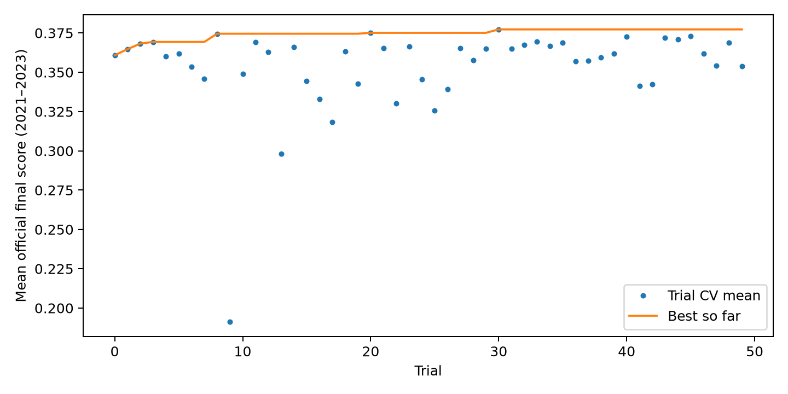
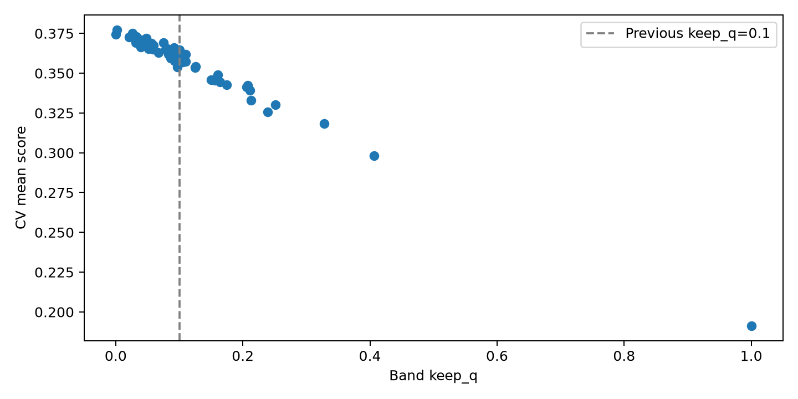
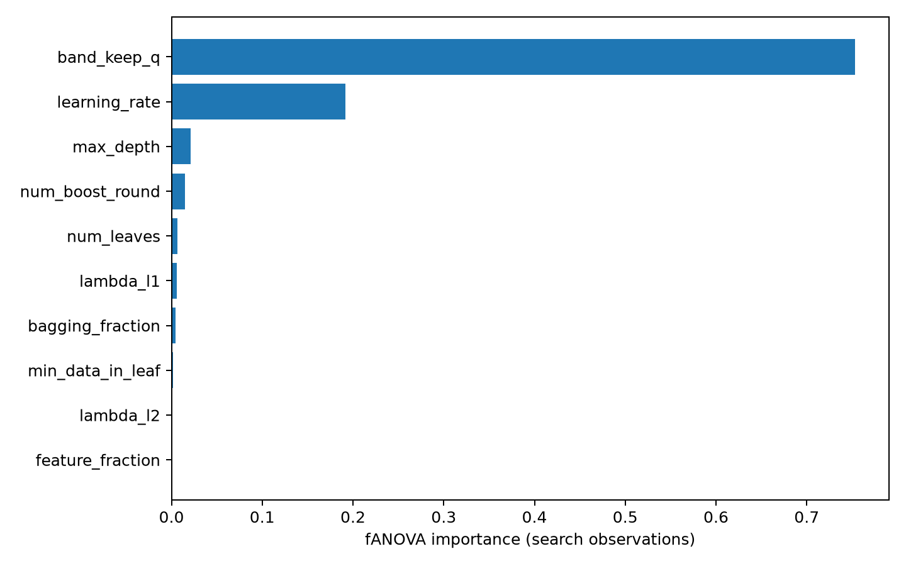

# S003：LightGBM 与 band 联合自动调参

更新时间：2026-10-08T03:21:21+08:00

状态：已完成锁定后的 2024 评估。

## 固定协议

50 个联合 trial；40 特征；2021 / 2022 / 2023 扩展窗口；三折共用一个 keep_q；
目标为三折官方综合分等权均值。模型按固定轮数训练，无验证早停、无 pruning。
keep_q 开放 0–1；前十组有八组集中于 0.05–0.15，另两组检查 0 / 1；
完整参数与 band 共同选优，IC 不设额外筛选门槛。每折独立冷启动，行序为日期、股票代码。

训练实现提交：`0e66680b4738ceade33eb18267bffb58af717e11`；代码摘要：`e899733e648492bd9676db8c66d73e03ba3dec221f1e04fc709bc0e6ee9f74b9`；
协议摘要：`726c5538ec8c7adae0e31fe51f1da13d421392b22cbc846d9945b36f8adf8e3c`；锁定摘要：`2206cc007787f8c988f5de191950efb89fcd6ee724d5b96b9f45169e63ec2367`。

有效 trial：50；失败 trial：0；
派生对照：3（只评分，无额外训练）。

## 候选与同层对照

|方案|keep_q|2021|2022|2023|三折均值|标准差|
|---|---:|---:|---:|---:|---:|---:|
|T000|0.1|0.3806558623|0.3706094021|0.3311484802|0.3608045815|0.0213673598|
|T001|0.1|0.3785740078|0.3723137330|0.3432856318|0.3647244576|0.0153734662|
|D000|0.002277829811|0.3753593171|0.3855009177|0.3537520361|0.3715374236|0.0132401667|
|D001|0.002277829811|0.3777877942|0.3816379340|0.3532597166|0.3708951483|0.0125688035|
|D002|0.1|0.3892483532|0.3781572917|0.3219951733|0.3631336060|0.0294395528|
|T030|0.002277829811|0.3885388115|0.3861836281|0.3570976762|0.3772733720|0.0142987353|

最优完整配置：

```json
{
  "sampled_params": {
    "learning_rate": 0.04065467822968424,
    "num_leaves": 28,
    "max_depth": 8,
    "min_data_in_leaf": 415,
    "feature_fraction": 0.660945618691071,
    "bagging_fraction": 0.9204918282790925,
    "lambda_l1": 2.086527798462595,
    "lambda_l2": 0.011862211698474496,
    "num_boost_round": 800,
    "band_keep_q": 0.0022778298112255263
  },
  "model_params": {
    "objective": "regression",
    "boosting_type": "gbdt",
    "metric": "l2",
    "learning_rate": 0.04065467822968424,
    "num_leaves": 28,
    "max_depth": 8,
    "min_data_in_leaf": 415,
    "lambda_l1": 2.086527798462595,
    "lambda_l2": 0.011862211698474496,
    "feature_fraction": 0.660945618691071,
    "bagging_fraction": 0.9204918282790925,
    "bagging_freq": 1,
    "max_bin": 255,
    "seed": 42,
    "num_threads": 8,
    "device_type": "cpu",
    "deterministic": true,
    "force_col_wise": true,
    "use_missing": true,
    "zero_as_missing": false,
    "verbosity": -1
  },
  "rounds": 800,
  "keep_q": 0.0022778298112255263,
  "initial_state": "cold_start"
}
```

## 分项表现

|年份|原始 IC|band IC|band 年化超额|band 换手|band 综合分|
|---|---:|---:|---:|---:|---:|
|wf2021|0.0794982884|0.0664610415|0.2297282756|0.0232136259|0.3885388115|
|wf2022|0.0918571110|0.0810647459|0.1960246105|0.0168321779|0.3861836281|
|wf2023|0.0614187359|0.0502418651|0.1357850961|0.0124486621|0.3570976762|

相对本轮 V1 + band(0.1) 的官方得分归因：

|年份|IC 项变化|超额项变化|稳定性项变化|总分变化|
|---|---:|---:|---:|---:|
|wf2021|-0.0015675749|-0.0199442497|+0.0293947738|+0.0078829492|
|wf2022|-0.0006564212|-0.0109826246|+0.0272132719|+0.0155742260|
|wf2023|-0.0023840681|-0.0019860648|+0.0303193290|+0.0259491960|

## 锁定后的 2024 历史验证

搜索候选先提交、推送后，以 `4ff38535540938698596eb4dfb0fa127ebd52863` 启动 2024。

|方案|IC|年化超额|换手|综合分|
|---|---:|---:|---:|---:|
|selected_raw|0.0987252994|0.4522342575|0.8605334796|0.2170003531|
|selected_joint|0.0843562247|0.2011622338|0.0223627069|0.3873823479|
|selected_model_band01|0.0895603791|0.1462764698|0.1143010832|0.3454167676|
|V1_band01|0.0835076007|0.1547167754|0.1021335290|0.3491780142|
|L1_band01|0.0811789919|0.1550584202|0.0952762911|0.3504062355|

## 产物与解释边界

本地产物：`outputs/metrics/research_studies/S003`；图表：`outputs/figures/S003`。
每个通过的原始 / band 实验已按原 20 列格式追加共享表，CV 均值单独记录。
原始数据与三个官方附件不变；完整键、模型重载与落盘官方八指标均在运行内核对。
2023 / 2024 及 band 设计此前已参与研究；2024 并非未触碰的独立留出集。
keep_q 较小时，综合分可能主要受低换手推动；分项归因须与预测能力一起解读。
本轮未新增或运行测试套件，未训练正式全数据提交模型，未生成测试 submission。
50 次搜索不保证全局最优；正式推荐方案的变更需结合本报告及成员 B 的复核。

## 联合优化的贡献与执行核对

2024 相对 V1 + band(0.1) 提高 **0.0382043338**。IC 项 / 超额项 / 稳定性项分别贡献
+0.0003394496（0.89%） / +0.0139336375（36.47%） / +0.0239312466（62.64%）。

V1 只改变 band：CV 均分 0.3608045815 → 0.3715374236；
在同一最优 band 下换成 T030：0.3715374236 → 0.3772733720。
T030 自身 band(0.1) 的均分为 0.3631336060。模型与 band 的效果依赖其组合。

2021–2023 相对 V1 + band(0.1) 的 IC 与年化超额均下降，综合分提升主要来自低换手；
2024 确认中 IC、超额与稳定性三项均提高。2024 是此前使用过的历史验证期。

全程 151 次训练、312 条新记录；共享表 363 条，
原 51 条未改动。完整键、原始文件、冻结参照与全部产物摘要核对通过，
官方八指标最大差和模型重载最大差均为 0。2024 只新拟合一个锁定模型。

fANOVA：band_keep_q 的观察重要性约 75.30%，learning_rate 约 19.19%；
这是本轮有限搜索的结果，受其他参数、范围和试验分布影响，不能解释为因果贡献。

## 月度与季度描述性诊断

以下切片沿用全年信号和留仓状态，季度边界不重新冷启动；它们用于描述已锁定方案，
不参与本轮选优。IC 为该月日度 IC 的均值，超额为该月日均超额按 252 年化。

|年份|正 IC 月数|正超额月数|最低分月份|该月综合分|
|---|---:|---:|---|---:|
|2021|12/12|11/12|202112|0.3064574507|
|2022|12/12|12/12|202211|0.3443962839|
|2023|12/12|7/12|202307|0.2603334297|
|2024|12/12|10/12|202401|0.1829258269|

2024 年 1 月锁定方案的年化超额为 -0.4051534122，全年改善仍有脆弱月份。
月度 / 季度表、完整 trial 表和重要性摘要已放入 experiments/optuna_S003_*，便于 GitHub 交接。

## 图表







## 后续交接

S003 T030 为本轮最高分候选；成员 B 尚未独立复现这一轮。按产物索引核对模型、预测、标签、
官方八指标与分项归因，再由两人确定 Day 14 的正式方案及测试期留仓初始状态。
本轮不追加训练或调参。正式比赛测试得分仍需官方隐藏标签。
