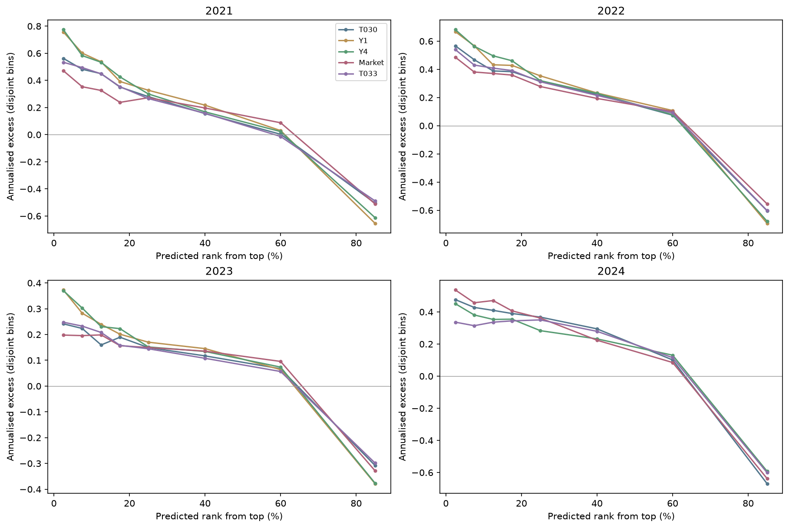
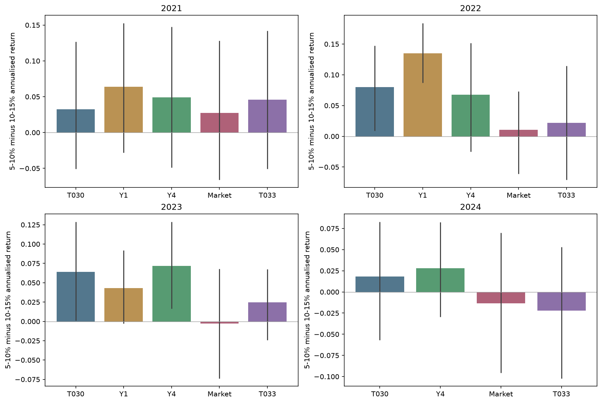
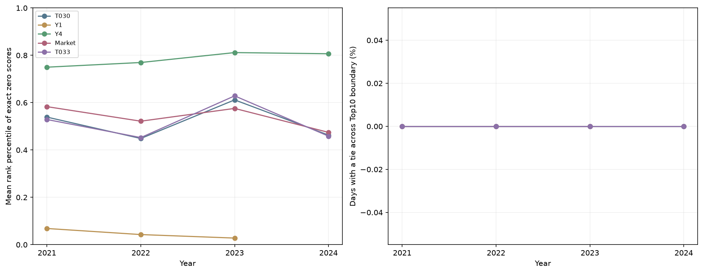
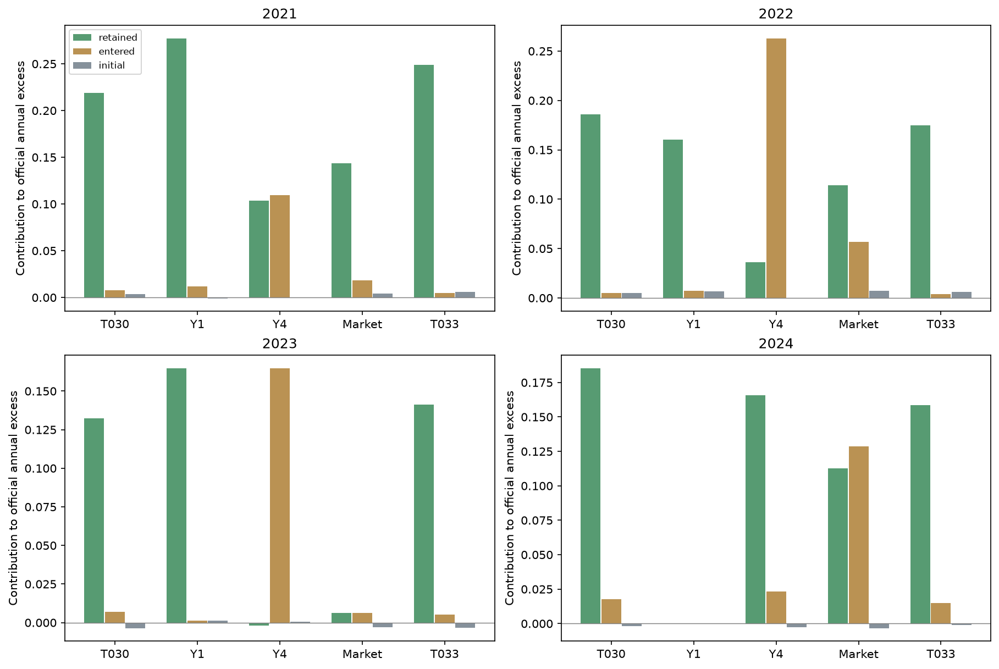
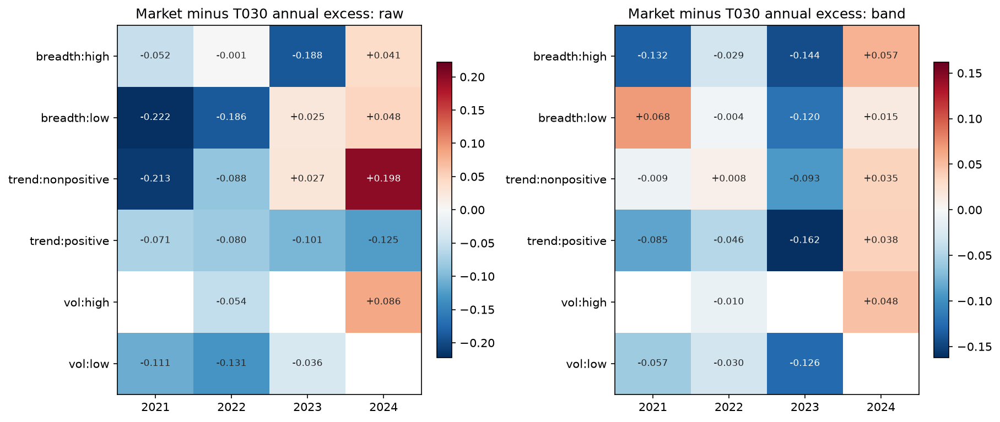
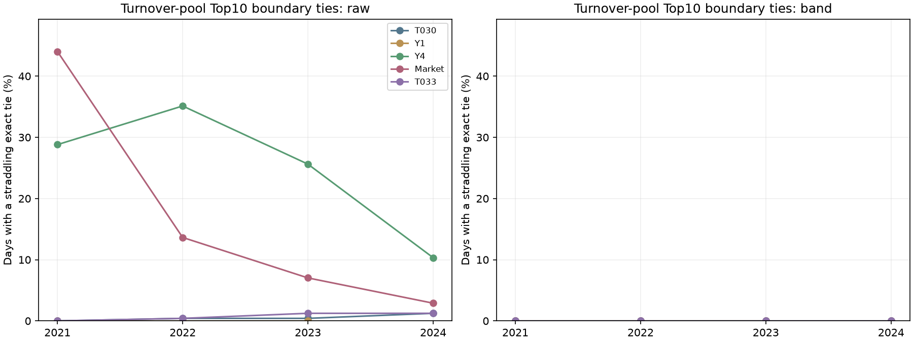

# S009：头部边界、并列与留仓收益诊断

完成时间：2026-10-10T16:11:56+08:00

执行源码先提交、推送 main `0141f10c23988a591d8ca1b700d4631907a8b968`；输入 / 配置 / 源码摘要独立归档。
本轮为零训练诊断：19 个模型年度 × raw / 原 q* band = 38 个主比较单元；Y1 的 2024 缺失，不补训。正式研究参照保留 S003，没有产生新提交模型或隐藏测试成绩。

## 主要发现与后续决定

1. **来源与官方计算已通过。** 38 个主比较、76 个行序敏感性评分与原官方附件核对；主比较和来源八指标差异均为 0。11 个历史模型重载最大差 8.882e-16，19 次 q* 真实前缀和市场特征前缀通过。没有新拟合，共享表原 718 条逐条不变。S007/T033 缺原模型，Y1 缺 2024；这些缺口保留。
2. **存在头部改进空间，但不是没有 Alpha。** Y4 raw 在 2021–2024 的 Top20 区域 IC 约 0.016–0.022，剩余 80% 约 0.099–0.121；限制预测排名范围本身也会降低相关性，不能把全部 IC 改善归因于中部。5–10% 相对 10–15% 的收益差在三个 CV 年份中两个的 95% 区间跨 0，2024 也跨 0。年度分层收益整体有序、raw 超额为正，因此结果支持有限头部实验，不证明现有回归无效。
3. **事件召回与收益金额要分开。** Y4 的因果 Top20 候选只召回未来 Top10 收益事件约 14–16%，Top30 约 21–23%；它仍有正超额。单纯提高极端事件命中未必提高平均组合收益。S010 保留全市场 B10/B20 对照，R20/R30/L30 还要面对池外事件无法恢复的限制。
4. **并列问题集中在 raw 换手池。** 收益池边界跨切线并列合计 0 个单元日，换手池合计 418 个单元日（同一交易日可出现于多个模型）。最大行序分差为 -0.0043181507，出现在 Market / 2021 / raw / permuted_seed42；IC 和超额差为 0，变化来自换手。本次已生成的 q* 分数文件直接改行序最大分差 0.0e+00。该项没有重新用置换 raw 运行 band，不能据此断言控制器对任意原始行序都不敏感。
5. **留仓解释受两种池影响。** T030 的四年超额贡献主要来自收益池中的留仓组；Y4 在 2022/2023 的贡献主要来自不属于昨日换手 Top 的收益池成员，2024 则回到留仓组。这些补入成员可能由缺 y 过滤产生，不能直接称为控制器买入 Alpha，也不能把缺价占位成员当作可交易仓位。
6. **先进入 S010，暂缓 S011，保留 S003。** CV 的六种市场状态均未在至少两个有足够日数的年份重复获得满足 IC 条件的正超额优势；2024 单年改善不足以支持门控。按执行前门槛，S010 条件成立、S011 条件不成立。下一阶段仍按最多 18 次拟合与锁定后一次历史检查执行，正式参照不变。

以下为收益池人数加权、按全年日数年化的贡献；三组相加恢复对应官方年化超额。

|model|year|cohort|annual_excess_contribution|
|---|---|---|---|
|T030|2021|entered|0.0076732765|
|T030|2021|initial|0.0033969967|
|T030|2021|retained|0.2186580025|
|Y4|2021|entered|0.1092674477|
|Y4|2021|initial|0.0002624307|
|Y4|2021|retained|0.1036625063|
|T030|2022|entered|0.0049205405|
|T030|2022|initial|0.0050576510|
|T030|2022|retained|0.1860464191|
|Y4|2022|entered|0.2629703092|
|Y4|2022|initial|-0.0004260495|
|Y4|2022|retained|0.0364431182|
|T030|2023|entered|0.0069314696|
|T030|2023|initial|-0.0036234759|
|T030|2023|retained|0.1324771025|
|Y4|2023|entered|0.1648874087|
|Y4|2023|initial|0.0007345333|
|Y4|2023|retained|-0.0019911751|
|T030|2024|entered|0.0176683214|
|T030|2024|initial|-0.0019425586|
|T030|2024|retained|0.1854364709|
|Y4|2024|entered|0.0231795109|
|Y4|2024|initial|-0.0025514335|
|Y4|2024|retained|0.1656583362|

## 官方口径与来源验收

主比较落盘官方八指标最大差 0.000e+00；与来源已发布指标最大差 0.000e+00。完整键 / 有限值 / canonical 行序均核对。
11 个可用历史原生模型重新加载并推理；实际原生 / CSV 最大差 8.882e-16。S007/T033 原模型未保存，无法补做其原生重载核对。
raw → q* 只传入键、pred、涨停标志；全年冷启动连续递推。实际 Top 集合与值、19 次真实前缀重放已核对；完整顺序 / 并列与两种 CSV 解析的差异单独保留。

|model|year|layer|ic_mean|annual_excess|mean_turnover|final_score|
|---|---|---|---|---|---|---|
|T030|2021|raw|0.0794982884|0.5222501877|0.8662557951|0.2285976332|
|T030|2021|band|0.0664610415|0.2297282756|0.0232136259|0.3885388115|
|Y1|2021|raw|0.1296720988|0.6791810431|0.8417776291|0.3030898637|
|Y1|2021|band|0.1101269579|0.2884490711|0.0169212563|0.4255091276|
|Y4|2021|raw|0.1240158292|0.6784773362|0.8726151416|0.2913649901|
|Y4|2021|band|0.1073315603|0.2131923847|0.0167402850|0.4018682540|
|Market|2021|raw|0.0786574993|0.4122301128|0.8139901867|0.2109349775|
|Market|2021|band|0.0705194159|0.1658728146|0.0170396573|0.3728577135|
|T033|2021|raw|0.0771115002|0.5141273632|0.8601770512|0.2270296937|
|T033|2021|band|0.0659818491|0.2594562756|0.0214724434|0.3977878893|
|T030|2022|raw|0.0918571110|0.5177466410|0.8664525497|0.2321310718|
|T030|2022|band|0.0810647459|0.1960246105|0.0168321779|0.3861836281|
|Y1|2022|raw|0.1316006383|0.6171753296|0.8370063671|0.2866909441|
|Y1|2022|band|0.1130188857|0.1741897843|0.0127865101|0.3936285365|
|Y4|2022|raw|0.1303190270|0.6227346848|0.8632617264|0.2799694983|
|Y4|2022|band|0.1161275385|0.2989873779|0.0110342540|0.4328369526|
|Market|2022|raw|0.0861249297|0.4334943559|0.8546621044|0.2080996473|
|Market|2022|band|0.0776629284|0.1780294316|0.0138025789|0.3803332272|
|T033|2022|raw|0.0899326523|0.4852473468|0.8679328024|0.2211674242|
|T033|2022|band|0.0801828316|0.1851285838|0.0157790258|0.3828780000|
|T030|2023|raw|0.0614187359|0.2324662236|0.8839403796|0.1291252475|
|T030|2023|band|0.0502418651|0.1357850961|0.0124486621|0.3570976762|
|Y1|2023|raw|0.1057085199|0.3277386158|0.8348562682|0.1901481122|
|Y1|2023|band|0.0936552139|0.1673898050|0.0084137750|0.3851548946|
|Y4|2023|raw|0.1043339342|0.3364741858|0.8607638694|0.1844466686|
|Y4|2023|band|0.0924171839|0.1636307670|0.0071064632|0.3839241647|
|Market|2023|raw|0.0609818001|0.1967849029|0.8466638117|0.1294290474|
|Market|2023|band|0.0464767883|0.0092891062|0.0106388091|0.3181858045|
|T033|2023|raw|0.0612459496|0.2402517084|0.8846479282|0.1311795139|
|T033|2023|band|0.0523545105|0.1429684980|0.0110683521|0.3605118480|
|T030|2024|raw|0.0987252994|0.4522342575|0.8605334796|0.2170003531|
|T030|2024|band|0.0843562247|0.2011622338|0.0223627069|0.3873823479|
|Y4|2024|raw|0.1178438963|0.4159944841|0.8424115386|0.2192124422|
|Y4|2024|band|0.1045585727|0.1862864136|0.0170379565|0.3925979662|
|Market|2024|raw|0.1016106196|0.4968555146|0.8704730693|0.2285589814|
|Market|2024|band|0.0903343209|0.2377218945|0.0168235922|0.4024032191|
|T033|2024|raw|0.0920463619|0.3251919708|0.8639779722|0.1751827443|
|T033|2024|band|0.0805240920|0.1724051155|0.0216544394|0.3774348396|

## 头部收益与候选池上限

分层在官方收益池中按实际评分排序；互斥区间和累计 Top 分开保存。真实事件用 y 平均百分位，精确并列保持同标签。推理候选池由 raw、t 日有效价格与非涨停形成，先构造候选，再用已有标签评召回；缺 y 不进入选择输入。召回低意味着精排无法找回池外股票，不是新模型已证实失败。

|model|year|gap_annualized|gap_ci_lower|gap_ci_upper|precision10|inference_recall20|inference_recall30|
|---|---|---|---|---|---|---|---|
|T030|2021|0.0322658505|-0.0505291874|0.1267672858|0.1181466648|0.2143171936|0.3040782972|
|Y1|2021|0.0638243475|-0.0280404758|0.1527842340|0.0781468080|0.1450308877|0.2154995877|
|Y4|2021|0.0491529060|-0.0487841341|0.1477051272|0.0915633426|0.1611307427|0.2271039235|
|Market|2021|0.0273441900|-0.0658818967|0.1283470779|0.1124281421|0.1974006166|0.2764235305|
|T033|2021|0.0459903103|-0.0508001526|0.1418143381|0.1178454866|0.2149658013|0.3060112388|
|T030|2022|0.0799580280|0.0087847783|0.1472799186|0.1108939264|0.2018264735|0.2898258010|
|Y1|2022|0.1347717927|0.0871289131|0.1841087997|0.0757541234|0.1441738712|0.2166249721|
|Y4|2022|0.0678705759|-0.0248502589|0.1515498526|0.0858708571|0.1561607122|0.2241784491|
|Market|2022|0.0105266080|-0.0610955551|0.0728467828|0.1131687964|0.2067577139|0.2924804262|
|T033|2022|0.0217083306|-0.0706321345|0.1142606430|0.1066276942|0.1988661359|0.2885626289|
|T030|2023|0.0638704106|0.0009480279|0.1288730011|0.1160349719|0.2042594786|0.2863218408|
|Y1|2023|0.0431034290|-0.0028957535|0.0918789947|0.0653464797|0.1293010070|0.1992325133|
|Y4|2023|0.0718570733|0.0166819336|0.1286995967|0.0770544199|0.1399735647|0.2058127138|
|Market|2023|-0.0028399142|-0.0737493309|0.0678300035|0.1239154942|0.2163631276|0.2993465944|
|T033|2023|0.0245909935|-0.0241247203|0.0673755613|0.1141318297|0.2030378056|0.2865853693|
|T030|2024|0.0183819865|-0.0567124477|0.0829182775|0.1072030127|0.1945356236|0.2807087290|
|Y4|2024|0.0278156698|-0.0295790365|0.0822606402|0.0792067077|0.1496991670|0.2214756362|
|Market|2024|-0.0136050747|-0.0956961707|0.0697948904|0.1055907706|0.1941164854|0.2768487009|
|T033|2024|-0.0219424280|-0.1021796360|0.0530874318|0.1031763289|0.1894820383|0.2743111843|

区间是 20 日循环块、1000 次、seed=42 的配对 / 日期统计抽样；分层 gap 是年化辅助量。股票池内中位数为实际 pooled median；均值 / 超额以日等权。

## 精确并列、零预测与行序

|model|year|duplicate_count_mean|largest_tie_mean|boundary_crossed_days|zero_rank_mean|fallback_turn_top_mean|fallback_return_top_mean|
|---|---|---|---|---|---|---|---|
|T030|2021|634.1893004115|635.1028806584|0|0.5389791584|0.0000000000|0.0000000000|
|Y1|2021|634.1893004115|635.1028806584|0|0.0683981592|0.0000000000|0.0000000000|
|Y4|2021|634.1893004115|635.1028806584|0|0.7498805257|38.9423868313|0.0000000000|
|Market|2021|634.2716049383|635.1028806584|0|0.5831598743|173.9958847737|0.0000000000|
|T033|2021|634.2139917695|635.1028806584|0|0.5287893270|0.0000000000|0.0000000000|
|T030|2022|395.1404958678|396.1157024793|0|0.4485897094|0.3223140496|0.0000000000|
|Y1|2022|395.1404958678|396.1157024793|0|0.0427015018|0.0000000000|0.0000000000|
|Y4|2022|395.1404958678|396.1157024793|0|0.7696267662|67.4173553719|0.0000000000|
|Market|2022|395.3016528926|396.1157024793|0|0.5217150982|124.7603305785|0.0000000000|
|T033|2022|395.1446280992|396.1157024793|0|0.4524562339|0.0661157025|0.0000000000|
|T030|2023|257.5330578512|258.4834710744|0|0.6117102106|0.4669421488|0.0000000000|
|Y1|2023|257.5000000000|258.4834710744|0|0.0279014485|0.0000000000|0.0000000000|
|Y4|2023|257.4917355372|258.4834710744|0|0.8115724696|39.6652892562|0.0000000000|
|Market|2023|258.0041322314|258.4834710744|0|0.5756673776|101.0247933884|0.0000000000|
|T033|2023|257.5206611570|258.4834710744|0|0.6286381409|0.9586776860|0.0000000000|
|T030|2024|126.4958677686|127.4917355372|0|0.4629321070|1.4586776860|0.0000000000|
|Y4|2024|126.5000000000|127.4917355372|0|0.8066600018|53.7603305785|0.0000000000|
|Market|2024|127.8429752066|127.4917355372|0|0.4744819159|42.9338842975|0.0000000000|
|T033|2024|126.4958677686|127.4917355372|0|0.4584924020|0.2520661157|0.0000000000|

duplicate_count 是 N−unique，与属于重复组的总人数不同。缺价 raw 0 与有效价格下真实输出 0 分开；band 编码后不再用最终 pred==0 当作缺价标记。逆序与固定日内置换只移动原文件行字节，不重新序列化数字。行序敏感性只用于描述，正式排序不按得分重新选择。

|model|layer|max_abs_score_delta|max_official_difference|
|---|---|---|---|
|Market|band|0.0000000000|0.0000000000|
|Market|raw|0.0043181507|0.0000000000|
|T030|band|0.0000000000|0.0000000000|
|T030|raw|0.0000000000|0.0000000000|
|T033|band|0.0000000000|0.0000000000|
|T033|raw|0.0000000000|0.0000000000|
|Y1|band|0.0000000000|0.0000000000|
|Y1|raw|0.0000000000|0.0000000000|
|Y4|band|0.0000000000|0.0000000000|
|Y4|raw|0.0006940414|0.0000000000|

## 留仓、换入和两种官方池

H_turn 只删除涨停；H_ret 另删除缺 y。状态集合的可评分收益不冒充官方 Top 收益。下面把 H_ret 按是否在昨日 H_turn 分组，其加权贡献（包括首日 initial）精确相加为全年官方超额。

|model|year|cohort|n_mean|mean_ret_mean|annual_excess_contribution|
|---|---|---|---|---|---|
|T030|2021|entered|5.3760330579|0.0014249791|0.0076732765|
|T030|2021|initial|372.0000000000|0.0016497050|0.0033969967|
|T030|2021|retained|387.5082644628|0.0015187625|0.2186580025|
|Y1|2021|entered|3.9132231405|0.0060698160|0.0120716997|
|Y1|2021|initial|372.0000000000|-0.0025425645|-0.0009505421|
|Y1|2021|retained|388.9710743802|0.0017500233|0.2773279134|
|Y4|2021|entered|46.0082644628|0.0041830708|0.1092674477|
|Y4|2021|initial|372.0000000000|-0.0013729122|0.0002624307|
|Y4|2021|retained|346.8760330579|0.0011042509|0.1036625063|
|Market|2021|entered|26.2644628099|0.0047402044|0.0181602124|
|Market|2021|initial|372.0000000000|0.0025711986|0.0043526196|
|Market|2021|retained|366.6198347107|0.0012251767|0.1433599825|
|T033|2021|entered|4.9586776860|0.0018389673|0.0048568122|
|T033|2021|initial|372.0000000000|0.0040592065|0.0058957389|
|T033|2021|retained|387.9256198347|0.0016385135|0.2487037245|
|T030|2022|entered|3.8962655602|0.0040963542|0.0049205405|
|T030|2022|initial|405.0000000000|-0.0095418054|0.0050576510|
|T030|2022|retained|413.5643153527|0.0002859937|0.1860464191|
|Y1|2022|entered|2.9585062241|0.0051321618|0.0074409013|
|Y1|2022|initial|405.0000000000|-0.0081628383|0.0064936001|
|Y1|2022|retained|414.5020746888|0.0001788910|0.1602552828|
|Y4|2022|entered|147.5892116183|0.0025152186|0.2629703092|
|Y4|2022|initial|405.0000000000|-0.0148078987|-0.0004260495|
|Y4|2022|retained|269.8713692946|-0.0002340497|0.0364431182|
|Market|2022|entered|42.3112033195|0.0030730284|0.0566403505|
|Market|2022|initial|405.0000000000|-0.0074301210|0.0072565950|
|Market|2022|retained|375.1493775934|0.0000095086|0.1141324860|
|T033|2022|entered|3.6514522822|0.0012935469|0.0039959444|
|T033|2022|initial|405.0000000000|-0.0085799799|0.0060592213|
|T033|2022|retained|413.8091286307|0.0002406937|0.1750734181|
|T030|2023|entered|2.8962655602|0.0061722373|0.0069314696|
|T030|2023|initial|417.0000000000|0.0011586174|-0.0036234759|
|T030|2023|retained|431.6473029046|0.0005903689|0.1324771025|
|Y1|2023|entered|1.9543568465|0.0011290438|0.0012564445|
|Y1|2023|initial|417.0000000000|0.0060114168|0.0014298525|
|Y1|2023|retained|432.5892116183|0.0007179304|0.1647035080|
|Y4|2023|entered|194.2946058091|0.0014392583|0.1648874087|
|Y4|2023|initial|417.0000000000|0.0053436897|0.0007345333|
|Y4|2023|retained|240.2489626556|0.0002121805|-0.0019911751|
|Market|2023|entered|9.8215767635|0.0037940807|0.0061231518|
|Market|2023|initial|417.0000000000|0.0018188856|-0.0029359239|
|Market|2023|retained|424.7219917012|0.0000831287|0.0061018783|
|T033|2023|entered|2.5643153527|0.0038093647|0.0052167322|
|T033|2023|initial|417.0000000000|0.0013486591|-0.0034255812|
|T033|2023|retained|431.9792531120|0.0006247906|0.1411773470|
|T030|2024|entered|5.1493775934|0.0013983251|0.0176683214|
|T030|2024|initial|446.0000000000|-0.0052128938|-0.0019425586|
|T030|2024|retained|437.9709543568|0.0007026447|0.1854364709|
|Y4|2024|entered|11.6058091286|0.0044715303|0.0231795109|
|Y4|2024|initial|446.0000000000|-0.0057976071|-0.0025514335|
|Y4|2024|retained|431.5145228216|0.0006307028|0.1656583362|
|Market|2024|entered|92.7178423237|0.0022542175|0.1285575545|
|Market|2024|initial|446.0000000000|-0.0065706493|-0.0033564196|
|Market|2024|retained|350.4024896266|0.0005344505|0.1125207596|
|T033|2024|entered|4.9875518672|0.0041759253|0.0147362687|
|T033|2024|initial|446.0000000000|-0.0043572935|-0.0010516029|
|T033|2024|retained|438.1327800830|0.0005961741|0.1587204497|

|model|year|mean_spell_days|entered_n_mean_ex_first|mean_selected_raw_rank|raw_top_overlap_mean|forced_ineligible_exits|eligible_exits|
|---|---|---|---|---|---|---|---|
|T030|2021|63.2337514253|5.3842975207|0.5132343860|0.1636265445|1221|76|
|Y1|2021|79.3361945637|3.9132231405|0.5981308607|0.1450488705|914|27|
|Y4|2021|79.9077809798|3.8719008264|0.5423227706|0.1286152359|856|75|
|Market|2021|78.9409252669|3.9421487603|0.5218996383|0.1333449325|848|100|
|T033|2021|67.0163141994|4.9752066116|0.5199845577|0.1616942320|1115|83|
|T030|2022|79.4264178033|3.9004149378|0.5308767510|0.1305517456|848|85|
|Y1|2022|94.8893653516|2.9585062241|0.5912094355|0.1489387594|652|54|
|Y4|2022|103.5964419476|2.5518672199|0.6045929093|0.1503434054|522|86|
|Market|2022|90.4668847097|3.1950207469|0.5169678098|0.1277736598|648|115|
|T033|2022|82.9392803598|3.6556016598|0.5350712476|0.1299110309|799|75|
|T030|2023|96.7222222222|2.8962655602|0.4960721084|0.1242137339|580|115|
|Y1|2023|120.4583783784|1.9543568465|0.5651277557|0.1274510524|433|35|
|Y4|2023|130.7793427230|1.6514522822|0.6227563005|0.1202381952|271|124|
|Market|2023|106.1180952381|2.4730290456|0.4880064791|0.1195762194|492|101|
|T033|2023|103.7467411546|2.5726141079|0.5043030485|0.1229890793|524|93|
|T030|2024|64.8812463257|5.1576763485|0.5262991981|0.1372480975|1135|107|
|Y4|2024|78.7744468237|3.9128630705|0.5441110868|0.1373927122|840|102|
|Market|2024|79.5122478386|3.8589211618|0.5158865723|0.1735617698|805|124|
|T033|2024|66.4437086093|4.9917012448|0.5292909298|0.1368017402|1100|102|

首日单列；持仓段在年度末右删失，长度不是最终完整持有寿命。below_q 为实际换出者的已知阈值标记，resize_exits_minimum 只是规模缩小需要退出的下界，不伪装成旧控制器未保存的主动换仓操作日志。

## 市场状态与流动性 / 波动切片

波动 / 宽度阈值只取各外层年份之前的市场序列中位数，趋势阈值为 0。股票 amount / volatility_20 按当日已知 X 四分位分组，缺失单列。全部年份和三状态 family 的支持天数与区间保留，不足 60 日的状态不支持门控晋级。

|family|state|supported_years|positive_years|positive_ci_years|eligible_for_causal_gate_research|
|---|---|---|---|---|---|
|breadth|high|3|0|0|False|
|breadth|low|3|1|0|False|
|trend|nonpositive|3|1|0|False|
|trend|positive|3|0|0|False|
|vol|high|1|0|0|False|
|vol|low|3|0|0|False|

门控证据只统计 2021–2023 的 market raw 相对 T030，单年 / 单状态的条件差不证明因果关系；若进入 S011，必须用更早年度 OOF 学习当期权重，不能以本年表现配本年权重。

## 多时期不确定性与预声明月份

|model|period|metric|delta|lower|upper|
|---|---|---|---|---|---|
|Market|CV2021_2023|final_score|-0.0201477902|-0.0316374129|-0.0098822464|
|Market|CV2021_2023|annual_excess|-0.0694488766|-0.1056848480|-0.0371371478|
|Market|Historical2021_2024|final_score|-0.0113556249|-0.0223461082|-0.0005408178|
|Market|Historical2021_2024|annual_excess|-0.0429467423|-0.0769108349|-0.0069468948|
|T033|CV2021_2023|final_score|0.0031192071|-0.0025195600|0.0094333073|
|T033|CV2021_2023|annual_excess|0.0086717917|-0.0103942710|0.0292370188|
|T033|Historical2021_2024|final_score|-0.0001474717|-0.0063029314|0.0065107334|
|T033|Historical2021_2024|annual_excess|-0.0006854358|-0.0203131249|0.0212441470|
|Y1|CV2021_2023|final_score|0.0241574809|0.0112746839|0.0377008507|
|Y1|CV2021_2023|annual_excess|0.0228302260|-0.0187983759|0.0642413214|
|Y4|CV2021_2023|final_score|0.0289364185|0.0094488522|0.0491366216|
|Y4|CV2021_2023|annual_excess|0.0380908491|-0.0234919599|0.1016455352|
|Y4|Historical2021_2024|final_score|0.0230062184|0.0042802081|0.0427630292|
|Y4|Historical2021_2024|annual_excess|0.0248491818|-0.0349021484|0.0878067529|

各年内成对抽相同日期，再等权平均年度；只抽原时间路径已算好的 IC / 超额 / 换手日统计，不在拼接块边界制造新的持仓或换手。95% 区间不校正既往择模和多轮候选筛选，2021–2024 已被反复使用，不能称为独立留出。

|model|month|ic_mean|annual_excess|mean_turnover|final_score|
|---|---|---|---|---|---|
|T030|202401|0.0216525215|-0.4051534122|0.0139638602|0.1829258269|
|T030|202409|0.0710590279|0.9745639010|0.0250264437|0.6132848484|
|Y4|202401|0.0626182309|-0.1739782051|0.0074196677|0.2706279305|
|Y4|202409|0.0791372669|0.2499614366|0.0210423838|0.4003306226|
|Market|202401|0.0043074736|-0.5037113417|0.0088465204|0.1479556308|
|Market|202409|0.0688963814|0.5022044445|0.0202729884|0.4721379894|
|T033|202401|0.0136987964|-0.3665148688|0.0141701005|0.1912740278|
|T033|202409|0.0571064284|0.6702663289|0.0225103893|0.5171693533|

全部月份 / 季度在公共切片表，未只保存这些切片。

## 分流建议

- S010 头部学习：**True**。Y4 原始三折中，头部边界 gap 下界不为正的年份 2 个，因果候选召回不足的年份 3 个。
- S011 有限门控：**False**。按上述支持天数和过去年度重复性核对。
- 当前正式研究建议仍为 **retain_S003**；本轮没有训练新模型，诊断仅支持下一项有限实验。若第一阶段召回有限，应先比较全市场 B10/B20，再检验 R20/R30/L30 的精排是否补偿筛池损失。

S009 输入 / 预测 / 原数据 / 官方附件保持不变，共享表原 718 条全部保持，没有重复追加来源或把切片当作官方实验。模型缺失、Y1 2024 缺失、条件置信区间及历史选择偏差明确保留；成员 B 独立复核待接续。本轮没有新增或运行测试套件，不启动 S010/S011。

## 图表

## 两种边界的补充判读

精确并列不能只看收益池：同一组缺价 raw 0 可能被收益池的缺 y 条件删除，仍保留在换手池。因此收益边界没有 ties，并不等于所有官方指标对行序都不敏感。以下直接定位换手边界，并引用已完成的行序评分差；没有重新评分或更换正式排序。

|model|year|layer|turn_boundary_crossed_days|return_boundary_crossed_days|tie_missing_label_n_mean|max_abs_order_score_delta|max_abs_order_excess_delta|max_abs_order_turnover_delta|
|---|---|---|---|---|---|---|---|---|
|T030|2021|raw|0|0|0.0000000000|0.0000000000|0.0000000000|0.0000000000|
|T030|2021|band|0|0|0.0041152263|0.0000000000|0.0000000000|0.0000000000|
|Y1|2021|raw|0|0|0.0000000000|0.0000000000|0.0000000000|0.0000000000|
|Y1|2021|band|0|0|0.5308641975|0.0000000000|0.0000000000|0.0000000000|
|Y4|2021|raw|70|0|179.7818930041|0.0002302898|0.0000000000|0.0007676325|
|Y4|2021|band|0|0|0.5226337449|0.0000000000|0.0000000000|0.0000000000|
|Market|2021|raw|107|0|277.7489711934|0.0043181507|0.0000000000|0.0143938357|
|Market|2021|band|0|0|0.7242798354|0.0000000000|0.0000000000|0.0000000000|
|T033|2021|raw|0|0|0.0000000000|0.0000000000|0.0000000000|0.0000000000|
|T033|2021|band|0|0|0.0000000000|0.0000000000|0.0000000000|0.0000000000|
|T030|2022|raw|1|0|1.8181818182|0.0000000000|0.0000000000|0.0000000000|
|T030|2022|band|0|0|0.0041322314|0.0000000000|0.0000000000|0.0000000000|
|Y1|2022|raw|0|0|0.0000000000|0.0000000000|0.0000000000|0.0000000000|
|Y1|2022|band|0|0|0.3677685950|0.0000000000|0.0000000000|0.0000000000|
|Y4|2022|raw|85|0|138.5165289256|0.0006940414|0.0000000000|0.0023134714|
|Y4|2022|band|0|0|0.8429752066|0.0000000000|0.0000000000|0.0000000000|
|Market|2022|raw|33|0|58.9710743802|0.0000211073|0.0000000000|0.0000703576|
|Market|2022|band|0|0|2.4380165289|0.0000000000|0.0000000000|0.0000000000|
|T033|2022|raw|1|0|1.8181818182|0.0000000000|0.0000000000|0.0000000000|
|T033|2022|band|0|0|0.0041322314|0.0000000000|0.0000000000|0.0000000000|
|T030|2023|raw|1|0|0.6818181818|0.0000000000|0.0000000000|0.0000000000|
|T030|2023|band|0|0|0.0000000000|0.0000000000|0.0000000000|0.0000000000|
|Y1|2023|raw|0|0|0.0000000000|0.0000000000|0.0000000000|0.0000000000|
|Y1|2023|band|0|0|0.2520661157|0.0000000000|0.0000000000|0.0000000000|
|Y4|2023|raw|62|0|77.0743801653|0.0001222666|0.0000000000|0.0004075554|
|Y4|2023|band|0|0|1.4504132231|0.0000000000|0.0000000000|0.0000000000|
|Market|2023|raw|17|0|25.1570247934|0.0000990578|0.0000000000|0.0003301927|
|Market|2023|band|0|0|0.3636363636|0.0000000000|0.0000000000|0.0000000000|
|T033|2023|raw|3|0|1.9297520661|0.0000000000|0.0000000000|0.0000000000|
|T033|2023|band|0|0|0.0000000000|0.0000000000|0.0000000000|0.0000000000|
|T030|2024|raw|3|0|1.5413223140|0.0000000000|0.0000000000|0.0000000000|
|T030|2024|band|0|0|0.0041322314|0.0000000000|0.0000000000|0.0000000000|
|Y4|2024|raw|25|0|13.6239669421|0.0000107270|0.0000000000|0.0000357566|
|Y4|2024|band|0|0|0.0041322314|0.0000000000|0.0000000000|0.0000000000|
|Market|2024|raw|7|0|3.7644628099|0.0000019291|0.0000000000|0.0000064302|
|Market|2024|band|0|0|5.7933884298|0.0000000000|0.0000000000|0.0000000000|
|T033|2024|raw|3|0|1.5413223140|0.0000000000|0.0000000000|0.0000000000|
|T033|2024|band|0|0|0.0041322314|0.0000000000|0.0000000000|0.0000000000|

收益 Top 与实际换手 Top 的不同还会影响留仓解释：H_ret 中不属于昨日 H_turn 的股票，可能是官方缺 y 过滤之后的补入者，不能全部叫作控制器新买入。缺价占位股也不能据此解释为可交易仓位，本报告只复现比赛集合与统计口径。

## 事件召回与收益金额的区别

|model|year|annual_excess|gap_annualized|gap_ci_lower|gap_ci_upper|precision10|inference_recall20|inference_recall30|
|---|---|---|---|---|---|---|---|---|
|Y4|2021|0.6784773362|0.0491529060|-0.0487841341|0.1477051272|0.0915633426|0.1611307427|0.2271039235|
|Y4|2022|0.6227346848|0.0678705759|-0.0248502589|0.1515498526|0.0858708571|0.1561607122|0.2241784491|
|Y4|2023|0.3364741858|0.0718570733|0.0166819336|0.1286995967|0.0770544199|0.1399735647|0.2058127138|
|Y4|2024|0.4159944841|0.0278156698|-0.0295790365|0.0822606402|0.0792067077|0.1496991670|0.2214756362|

Top20/30 候选中未来极端 Top10 收益股票的召回，不能直接当作组合盈利能力；约 0.2 / 0.3 仅是均匀随机候选的名义覆盖参照，实际池、缺标签与 ties 会改变精确随机基线。Y4 的 raw 超额为正却未捕获多数极端收益事件，说明‘预测收益金额’和‘属于未来高分位的概率’需要分别检验。该结果不证明二分类优于回归；S010 应先保留全市场 B10/B20 的对照，同时核对事件命中、收益幅度、波动暴露及完整 q* 后的超额。精排也无法恢复池外股票。

本补充只读取已通过输入与表格、派生计数和解释图，不拟合、不重评预测、不改变诊断分流或正式参照。

