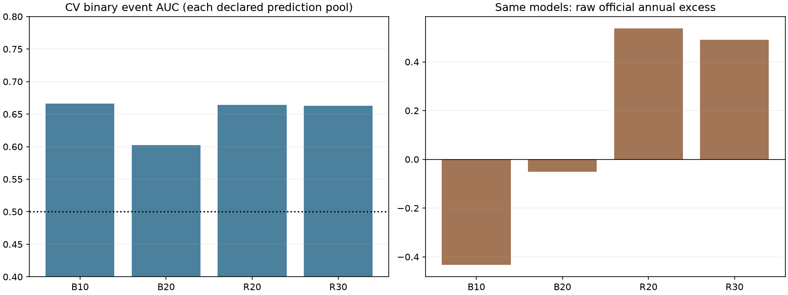
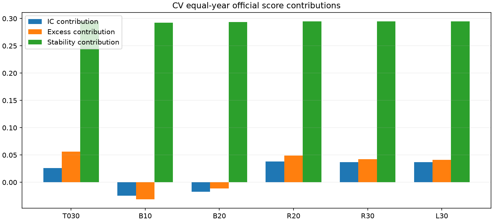
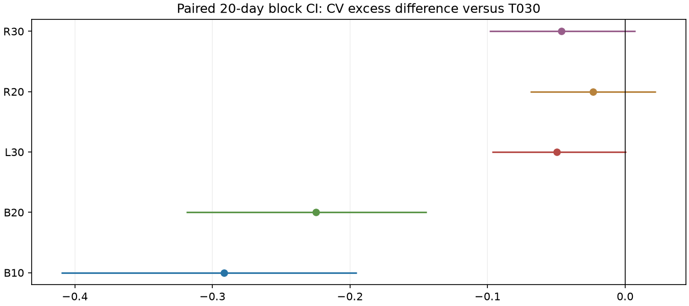
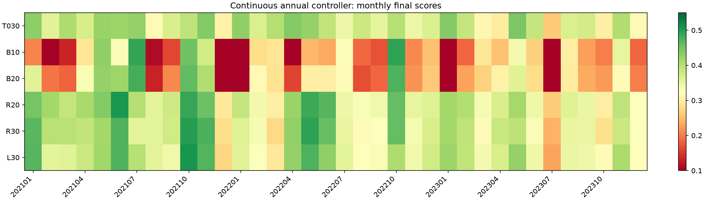
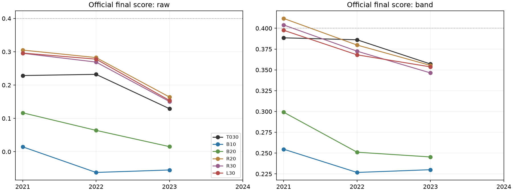

# S010：严格时间 OOF 的头部分类与排序

发布时间：2026-10-10T18:39:14+08:00

执行提交 `9714e72f76bac9f8fb12ebd24af96a68cd998fe6`；源码摘要 `9658e58c58117dc9f48d63efdf5fe96ae983b85cca791dc419e2cd318230c70d`；协议摘要 `c32efb820261ee0c37af8d7eb9adc1d20e11cfc8e239b7b8e598a88e446394dd`。

**阶段判断：retain_S003。** CV 锁定臂：无合格臂。新增拟合 17/18。

## 完成结论与判读

实际新增拟合 **17/18**，失败 0；原 718 条共享记录保留，新增 32 条。官方八指标最大差 0.0e+00，模型重载最大差 0.0e+00。

三折最高完整均分为 **R20 / 0.3823643875**。预声明选中方案：**无合格臂**；阶段建议：**retain_S003**。没有合格臂时保留 S003，2024 第二阶段拟合 / 新预测为 0；有合格臂时仅检查已先推送的唯一臂，检查结果不触发其他臂补跑。

### 为什么本轮没有晋级

- R20 只在 2021 提高 Top 超额，2022 / 2023 的年化超额分别为 0.142996 / 0.086043，低于 S003 的 0.196025 / 0.135785，也超过逐年最多下降 0.02 的容忍范围。
- R20 均分提升 +0.005091 的来源：IC 项 +0.011920、超额项 -0.006999、换手项 +0.000170。Top 收益未随排序相关性一起提高；ΔFinal 与 ΔExcess 的 95% 下界均不为正。
- B10 的 AUC 为 0.666490，raw 年化超额仍为 -0.433414。其实际 Top 组平均波动百分位 0.849248；正收益贡献 3.951369、负收益贡献 -4.369449，负收益抵消了正收益。结果支持本轮概率目标伴随较高波动暴露、未同时控制收益下侧的解释，未证明因果关系。
- R20 的 raw 超额和完整 q* 超额均未超过已存在的纯 Y4 同层 CV 对照；本轮没有发现足够稳健的第二阶段增量。训练时期不同仍是比较限制。

|model|ic_contribution|excess_contribution|turnover_contribution|final_delta|
|---|---|---|---|---|
|B10|-0.0506057214|-0.0874655837|-0.0020455986|-0.1401169037|
|B20|-0.0438074634|-0.0673809804|-0.0008794971|-0.1120679409|
|L30|0.0106735844|-0.0149137933|0.0000893075|-0.0041509013|
|R20|0.0119202541|-0.0069992108|0.0001699721|0.0050910155|
|R30|0.0106819436|-0.0138508697|0.0001766849|-0.0029922413|

### 与原有信号的同层对照

|model|layer|ic_mean|annual_excess|mean_turnover|final_score|
|---|---|---|---|---|---|
|B10|band|-0.0605917527|-0.1043726183|0.0243168171|0.2371564683|
|B10|raw|-0.0721120278|-0.4334135224|0.5843473835|-0.0341730829|
|B20|band|-0.0435961078|-0.0374239405|0.0204298122|0.2652054311|
|B20|raw|-0.0504375718|-0.0505397240|0.6643773591|0.0653498464|
|L30|band|0.0926065119|0.1374666832|0.0172004635|0.3731224707|
|L30|raw|0.1119851687|0.5031358843|0.8436440794|0.2426416090|
|R20|band|0.0957231862|0.1638486248|0.0169315815|0.3823643875|
|R20|raw|0.1157078590|0.5377227880|0.8566503873|0.2506048638|
|R30|band|0.0926274097|0.1410097616|0.0169092056|0.3742811307|
|R30|raw|0.1115551732|0.4913570659|0.8456779789|0.2383257954|
|T030|band|0.0659225508|0.1871793274|0.0174981553|0.3772733720|
|T030|raw|0.0775913784|0.4241543508|0.8722162415|0.1966179842|
|Y4|band|0.1052920942|0.2252701765|0.0116270007|0.4062097904|
|Y4|raw|0.1195562635|0.5458954022|0.8655469125|0.2519270523|

Y4 行为 S009 已评分的原有归因对照，未在本轮新增训练 / 官方记录。它与 T030 都从 2018 起训，本轮第二阶段从 2019 起训；样本时期、筛池、目标及完整信号重排可能共同改变结果。因此超过 S003 不自动等于第二阶段相对纯 Y4 的独立机制改善，也不意味着隐藏测试泛化。

### 事件判别与收益

|model|conditional_auc|conditional_logloss|ic_mean|annual_excess|final_score|
|---|---|---|---|---|---|
|B10|0.6664895268|0.3095618578|-0.0721120278|-0.4334135224|-0.0341730829|
|B20|0.6025492513|0.4900114706|-0.0504375718|-0.0505397240|0.0653498464|
|R20|0.6639887529|0.2576045214|0.1157078590|0.5377227880|0.2506048638|
|R30|0.6627150273|0.2501509503|0.1115551732|0.4913570659|0.2383257954|

AUC 评价正例概率的判别，官方超额评价收益金额。B10/B20 的 AUC 来自全允许监督池；R20/R30 来自各自候选池，不同池的 AUC 不能直接当成同一测试集的模型排名。应在每个方案内部同时看事件判别与金额收益，正例更常出现仍可能伴随较大的负收益；不会因为 AUC 高或某一折超过 0.4 而改动晋级门槛。

### 收益两侧与已知波动暴露

|model|layer|top_volatility_percentile|positive_return_component|negative_return_component|absolute_top_return|annual_excess|
|---|---|---|---|---|---|---|
|B10|band|0.7006869865|3.1629623185|-3.2520010507|-0.0890387322|-0.1043726183|
|B10|raw|0.8492478859|3.9513688769|-4.3694485132|-0.4180796363|-0.4334135224|
|B20|band|0.6762110783|3.0297397163|-3.0518297707|-0.0220900544|-0.0374239405|
|B20|raw|0.8251655218|3.7812753551|-3.8164811929|-0.0352058379|-0.0505397240|
|L30|band|0.5517843392|2.5970141716|-2.4442136023|0.1528005693|0.1374666832|
|L30|raw|0.5962508218|2.7208082815|-2.2023385111|0.5184697704|0.5031358843|
|R20|band|0.5375984469|2.5724142502|-2.3932317393|0.1791825109|0.1638486248|
|R20|raw|0.5484221828|2.6257050598|-2.0726483857|0.5530566741|0.5377227880|
|R30|band|0.5484962123|2.5882798532|-2.4319362055|0.1563436477|0.1410097616|
|R30|raw|0.5975715065|2.7291598219|-2.2224688700|0.5066909519|0.4913570659|
|T030|band|0.5081746448|2.5082460641|-2.3057328506|0.2025132135|0.1871793274|
|T030|raw|0.5700761510|2.7043889852|-2.2649007484|0.4394882368|0.4241543508|

上述收益分解直接读取已保存的实际官方收益 Top 集合，逐日按人数平均后年化；正负两项严格恢复官方 Top 年化绝对收益。波动百分位只用当日 V1 的 rank_volatility_20。它是暴露描述，不是风险导致收益变化的因果证明；不能仅凭 feature gain 或 AUC 给失败方案归因。完整年度行见 return_components 表。

### L30 排序辅助量

|model|year|query_days|mean_query_rows|mean_ndcg466|single_class_days|
|---|---|---|---|---|---|
|L30|2021|243|1179.3251028807|0.4541674558|0|
|L30|2022|242|1253.4049586777|0.4316904709|0|
|L30|2023|242|1304.4380165289|0.4144472113|0|

NDCG 使用验证候选中有监督标签的日组、全允许监督池的 0–4 序数与线性 gain，以完整 native tuple 编码的排序计算，精确预测并列按组内平均 gain 计期望 DCG；k=min(466,当日有监督候选数)。这是事后辅助统计，不进入训练、早停或晋级；标签总 gain 为零的日组标缺失。

成员 B 独立复核待完成；S011 的 S009 跨年条件仍不满足，S012 不自动扩参。正式提交阶段继续按团队固定方案接续。

## 协议与实际时间边界

第一阶段固定 Y4 / T030 / 800 轮：只新增 2018→2019、2018–2019→2020 两次预热，其余年度复用 S009 已验收的原生预测。第二阶段五臂各固定 400 轮与 T030 参数，40 个原特征加一个 Y4 时间外百分位；全部第二阶段从 2019 起训练。每个外层只用更早年度 OOF；第一阶段与第二阶段各自剔除最后交易日跨界标签。第一阶段的既有参数经过历史选择，嵌套日期正确并不能消除既往择模偏差。

B10/B20 在全允许监督池学习未来 Top10/20 事件；R20/R30 在由当日 X 与 OOF 形成的候选中学习全市场 Top10 事件；L30 使用全市场 0–4 序数、线性 label_gain、按交易日连续分组及固定截断 466。事件标签在候选筛选前定义，相同收益保持平均排名并列。所有候选先仅由 X / 预测形成，之后才移除无监督标签行。

完整输出采用精确整数平均排名编码，保留 native 的严格次序和全部 tuple ties；缺价格原始零组的编码锚定为 0。R 系列候选整体领先池外，池内按第二阶段 / 第一阶段排序，池外保持第一阶段顺序；不以代码打破第二阶段的同分同原分并列。完整信号最终只叠加一次原 q*，每年冷启动、全年连续；掉出候选池不额外清仓。原生值与候选 mask 单独无损保存。

## 官方全年结果

|model|year|layer|ic_mean|annual_excess|mean_turnover|final_score|
|---|---|---|---|---|---|---|
|B10|2021|raw|-0.0595134355|-0.2625666704|0.6092939131|0.0146364508|
|B10|2021|band|-0.0479018228|-0.0565616962|0.0306484482|0.2546762276|
|B20|2021|raw|-0.0369612609|0.1339731404|0.6954600641|0.1167694185|
|B20|2021|band|-0.0297249056|0.0628449049|0.0260552927|0.2991469215|
|R20|2021|raw|0.1197234300|0.7146827814|0.8574034157|0.3050731817|
|R20|2021|band|0.0997947118|0.2625071200|0.0227727151|0.4118382062|
|R30|2021|raw|0.1156443633|0.6755780442|0.8452284500|0.2953626236|
|R30|2021|band|0.0968936268|0.2406362069|0.0232458566|0.4039745558|
|L30|2021|raw|0.1158646548|0.6741446297|0.8416372659|0.2960980710|
|L30|2021|band|0.0973427538|0.2184580103|0.0228725282|0.3976127461|
|B10|2022|raw|-0.0732404444|-0.5170115156|0.5929361172|-0.0622804676|
|B10|2022|band|-0.0606258110|-0.1366435022|0.0266892295|0.2267498561|
|B20|2022|raw|-0.0482681859|-0.0560576310|0.6661288265|0.0640367884|
|B20|2022|band|-0.0412803125|-0.0856034843|0.0224044611|0.2510854914|
|R20|2022|raw|0.1267359328|0.6273659103|0.8544514919|0.2825686986|
|R20|2022|band|0.1048064718|0.1429957657|0.0165642347|0.3798520480|
|R30|2022|raw|0.1226081809|0.5807762397|0.8475079474|0.2690237600|
|R30|2022|band|0.1019157275|0.1221401017|0.0164185581|0.3724827541|
|L30|2022|raw|0.1231202433|0.6066274099|0.8446513939|0.2778409021|
|L30|2022|band|0.1010188247|0.1093324086|0.0170083054|0.3681047609|
|B10|2023|raw|-0.0835822034|-0.5206623811|0.5508121201|-0.0548752318|
|B10|2023|band|-0.0732476245|-0.1199126564|0.0156127737|0.2300433212|
|B20|2023|raw|-0.0660832687|-0.2295346813|0.6315431867|0.0152433322|
|B20|2023|band|-0.0597831053|-0.0895132422|0.0128296827|0.2453838804|
|R20|2023|raw|0.1006642142|0.2711196724|0.8580962544|0.1641727111|
|R20|2023|band|0.0825683749|0.0860429887|0.0114577946|0.3554029082|
|R30|2023|raw|0.0964129754|0.2177169137|0.8442975392|0.1505910025|
|R30|2023|band|0.0790728748|0.0602529763|0.0110632020|0.3463860822|
|L30|2023|raw|0.0969706081|0.2286356135|0.8446435785|0.1539858537|
|L30|2023|band|0.0794579573|0.0846096307|0.0117205569|0.3536499051|
|T030|2021|raw|0.0794982884|0.5222501877|0.8662557951|0.2285976332|
|T030|2021|band|0.0664610415|0.2297282756|0.0232136259|0.3885388115|
|T030|2022|raw|0.0918571110|0.5177466410|0.8664525497|0.2321310718|
|T030|2022|band|0.0810647459|0.1960246105|0.0168321779|0.3861836281|
|T030|2023|raw|0.0614187359|0.2324662236|0.8839403796|0.1291252475|
|T030|2023|band|0.0502418651|0.1357850961|0.0124486621|0.3570976762|

## 预声明晋级门槛

|model|period|mean_final|mean_delta_final|mean_delta_excess|final_ci_lower|excess_ci_lower|qualified|failed_gates|
|---|---|---|---|---|---|---|---|---|
|B10|CV2021_2023|0.2371564683|-0.1401169037|-0.2915519457|-0.1786963542|-0.4098261793|False|mean_score,mean_excess,positive_excess_years,each_excess,year2023_score,worst_year_score,each_ic,positive_months,worst_months,score_ci,excess_ci|
|B20|CV2021_2023|0.2652054311|-0.1120679409|-0.2246032679|-0.1430345614|-0.3189725483|False|mean_score,mean_excess,positive_excess_years,each_excess,year2023_score,worst_year_score,each_ic,positive_months,worst_months,score_ci,excess_ci|
|R20|CV2021_2023|0.3823643875|0.0050910155|-0.0233307026|-0.0089725046|-0.0689297954|False|mean_excess,positive_excess_years,each_excess,score_ci,excess_ci|
|R30|CV2021_2023|0.3742811307|-0.0029922413|-0.0461695658|-0.0196826734|-0.0987514822|False|mean_score,mean_excess,positive_excess_years,each_excess,year2023_score,worst_year_score,positive_months,worst_months,score_ci,excess_ci|
|L30|CV2021_2023|0.3731224707|-0.0041509013|-0.0497126442|-0.0181572835|-0.0967777349|False|mean_score,mean_excess,positive_excess_years,each_excess,worst_months,score_ci,excess_ci|

晋级只比较完整 q* 方案；逐年、月度尾部、IC 保留、超额和区间同时约束。没有合格臂则不生成新的 2024 第二阶段预测。只有唯一锁定清单提交 / 推送后才允许一次 2024 历史检查，不事后换臂、扩大预算或改变 keep_q。

## 核对与限制

实际 V1 全市场 2018 前缀重算、日标签 / 候选真实前缀、原生模型保存重载、完整键 / 有限值、编码 / CSV 严格排序与并列、完整信号 / q* 前缀及原官方八指标落盘核对随真实运行记录。每个拟合在调用前计入预算，失败不自动重试。已有 718 条共享记录保留，只追加真正通过的训练和派生完整方案。

配对区间抽取已在原连续路径计算的日 IC / 超额 / 换手：20 日循环块、1000 次、seed=42+year，年份等权。不在拼接月份或 bootstrap 边界重建控制器；区间是已使用历史样本的条件描述，不校正多轮历史选择。2021–2024 已用于既往研究；本研究不使用隐藏测试标签，也不推断正式测试成绩。事件命中改善不等于组合收益改善。

原 Y4 与 T030 从 2018 起训，第二阶段从 2019 起训；收益差也可能来自训练时期差异，不能全部归因于训练目标。S007/T033 原模型未保存与 Y1 2024 缺失不影响本轮选定的 Y4/T030 来源，仍保留为原阶段限制。成员 B 独立复核及团队采纳待接续。

LightGBM binary 标签、LambdaRank 整数标签与组数要求按[官方参数](https://lightgbm.readthedocs.io/en/stable/Parameters.html)及[Dataset 说明](https://lightgbm.readthedocs.io/en/stable/pythonapi/lightgbm.Dataset.html)落实。

## targets 实际统计

完整小型表：`experiments/top_tail_S010_targets.csv`。

## candidates 实际统计

完整小型表：`experiments/top_tail_S010_candidates.csv`。

## auxiliary 实际统计

完整小型表：`experiments/top_tail_S010_auxiliary.csv`。

## oof 实际统计

完整小型表：`experiments/top_tail_S010_oof.csv`。

